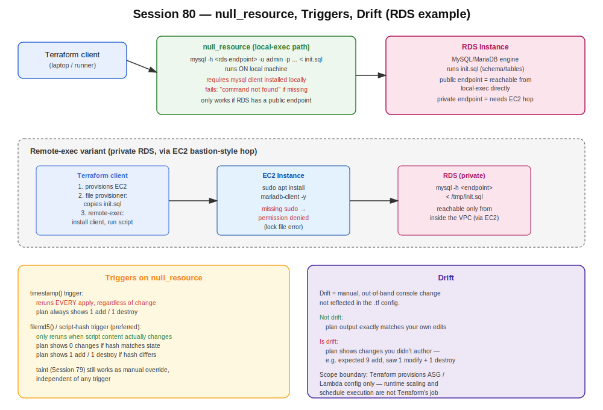

# Session 80 — Terraform: null_resource, Triggers & Drift

- Track: Terraform
- Topics: `null_resource`, `triggers` (`timestamp()` vs `filemd5()`), drift detection, `local-exec`/`remote-exec` RDS example
- Prerequisite context: provisioners not tracked by state, `terraform taint` (session-79)



## Why null_resource Exists

Provisioners (`local-exec`, `remote-exec`, `file`) live inside a `resource` block, but **Terraform state does not track what they do** — only whether the parent AWS resource itself changed (confirmed live in session-79). If you change a provisioner's script/command with no other config change, `terraform plan` shows zero changes — Terraform doesn't know the script changed.

`null_resource` is a dummy resource that Terraform *does* track in state, purely so provisioners/triggers have something to attach to without touching real infrastructure:

```hcl
resource "null_resource" "provision" {
  provisioner "local-exec" {
    command = "echo running"
  }
}
```

Putting provisioners directly in the EC2 resource block means any forced change there (e.g. via `taint`) destroys and recreates the **server itself**. Isolating them in a `null_resource` means only the null_resource gets destroyed/recreated — the EC2 instance is untouched.

## Triggers

`null_resource` supports a `triggers` map to force re-execution:

```hcl
resource "null_resource" "provision" {
  triggers = {
    always_run = timestamp()
  }

  provisioner "local-exec" {
    command = "echo running"
  }
}
```

- **Timestamp trigger** (`timestamp()`): reruns the provisioner on *every* `terraform apply`, regardless of whether anything changed. Destroys and recreates the null_resource each time.

```hcl
resource "null_resource" "provision" {
  triggers = {
    script_hash = filemd5("dev.sh")
  }

  provisioner "remote-exec" {
    script = "dev.sh"
  }
}
```

- **Script hash trigger** (`filemd5()`): only reruns when the actual script content changes — Terraform compares the stored hash in state to the current file hash. Preferred over timestamp — avoids unnecessary reruns on every apply.

**Confirmed live:**

| Trigger type | `terraform plan` with no script change | `terraform plan` after script edit |
|---|---|---|
| `timestamp()` | 1 to add, 1 to destroy (always) | 1 to add, 1 to destroy |
| `filemd5()` | 0 changes | 1 to add, 1 to destroy |

## Drift

Drift = difference between the local `.tf` config and actual remote state, caused by **manual out-of-band changes** (someone edited something directly in the console).

- **Signature:** `terraform plan` shows changes you didn't author — e.g. expected "9 to add" but see "1 modify, 1 destroy" that doesn't match the config diff.
- **Not drift:** plan output that matches exactly what you changed in the file.

## local-exec vs remote-exec vs file Provisioner — RDS Example

| Provisioner | Runs where | Use case |
|---|---|---|
| `local-exec` | Machine running `terraform apply` (laptop/CI runner) | Needs local tooling (e.g. `mysql` client) installed to reach a **public** RDS endpoint directly |
| `file` | N/A (copy step) | Copies a local file (e.g. `init.sql`) onto a remote instance before running a script there |
| `remote-exec` | Target server (via SSH, needs a `connection` block) | Runs commands **on** the EC2 instance — install a package, then execute a script |

Ordering matters: `connection` block -> `file` provisioner (copy script) -> `remote-exec` (run it). Putting `file` inside `remote-exec` or vice versa produces an error.

### Worked example — RDS + local-exec

```hcl
resource "aws_db_instance" "app_db" {
  # ... engine, instance_class, username, password, publicly_accessible = true ...
}

resource "null_resource" "init_db" {
  triggers = {
    script_hash = filemd5("init.sql")
  }

  provisioner "local-exec" {
    command = "mysql -h ${aws_db_instance.app_db.address} -u admin -p${var.db_password} < init.sql"
  }
}
```

- Only works if RDS is **publicly reachable** and the local machine has the `mysql` client installed — Terraform doesn't install it for you.

**Confirmed live:** running without the MySQL client installed locally produced exactly this failure — `mysql: command not found`. The RDS resource itself succeeded; only the `null_resource` (local-exec step) failed. Plan afterward showed 2 resources to add (RDS + null_resource each count as a resource).

### Worked example — remote-exec variant (private RDS)

Needs an EC2 instance (with key pair + `connection` block) in between:

```hcl
resource "null_resource" "init_db_remote" {
  connection {
    type        = "ssh"
    private_key = file("~/.ssh/id_rsa")
    user        = "ubuntu"
    host        = aws_instance.bastion.public_ip
  }

  provisioner "file" {
    source      = "init.sql"
    destination = "/tmp/init.sql"
  }

  provisioner "remote-exec" {
    inline = [
      "sudo apt install mariadb-client -y",
      "mysql -h ${aws_db_instance.app_db.address} -u admin -p${var.db_password} < /tmp/init.sql"
    ]
  }
}
```

**Confirmed live:** forgetting `sudo` on the `apt install` step failed with a package-manager lock-file permission error. The EC2 default user has sudo available, but commands must **explicitly** invoke it.

## Autoscaling Groups & Lambda — Scope Boundary

Terraform's responsibility ends at **provisioning**:

- **ASG:** Terraform creates the ASG with the launch template + min/max settings — it does not manage instance count changes, scaling events, or crashes from an undersized max capacity. That's the ASG's own runtime behavior, not Terraform's.
- **Lambda:** Terraform configures the function and its schedule/event source. If the schedule expression or event pattern is wrong, that's a configuration error, not something Terraform is responsible for at runtime.

## Practical Notes

- No fixed rule on how many provisioners to use per project — use only what the requirement demands.
- `terraform taint` (session-79) remains a manual override to force destroy+recreate on any resource, independent of triggers.
- Course-progress signal from class: Terraform expected to wrap in ~4 more sessions; CI/CD next (~1 week/8 days); then Maven/SonarQube (~2 days each, developer-owned tools); Docker + Kubernetes projected through ~October given the batch's pace.
