# Lab 3 — Application Load Balancer, Target Group & Failover
**Date:** April 30, 2026
**Course:** DevOps Bootcamp
**Region:** ap-south-1 (Mumbai)

---

## 🏗️ What I Built

A full production-pattern AWS architecture with a custom VPC, public and private subnets across two Availability Zones, a Bastion Host for admin access, a Regional NAT Gateway for private server internet access, two private App servers (App 3 and App 4) running Nginx, and an Application Load Balancer distributing traffic across both servers via a Target Group. Verified round-robin load balancing and failover by stopping Nginx on one server and confirming the LB routed traffic to the healthy server only.

---

## 📋 Resources Created

| Resource | Name | Details |
|---|---|---|
| VPC | dmo-vpc | CIDR: `10.0.0.0/16` |
| Public Subnet 1 | dmo-subnet-public1-ap-south-1a | `10.0.0.0/20`, AZ: ap-south-1a |
| Public Subnet 2 | dmo-subnet-public2-ap-south-1b | `10.0.16.0/20`, AZ: ap-south-1b |
| Private Subnet 1 | dmo-subnet-private1-ap-south-1a | `10.0.128.0/20`, AZ: ap-south-1a |
| Private Subnet 2 | dmo-subnet-private2-ap-south-1b | `10.0.144.0/20`, AZ: ap-south-1b |
| Internet Gateway | dmo-igw | Attached to dmo-vpc |
| NAT Gateway | dmo-regional-nat | Regional mode, public, EIPs in 1a + 1b |
| Route Table (public) | dmo-rtb-public | `0.0.0.0/0 → IGW`, both public subnets |
| Route Table (private 1a) | dmo-rtb-private1-ap-south-1a | `0.0.0.0/0 → NAT`, private subnet 1a |
| Route Table (private 1b) | dmo-rtb-private2-ap-south-1b | `0.0.0.0/0 → NAT`, private subnet 1b |
| Security Group | public-sg | Port 80 + 22 inbound, `0.0.0.0/0` |
| EC2 | bastion-host | t3.micro, ap-south-1a, public subnet |
| EC2 | myApp-3 | t3.micro, ap-south-1a, private subnet, Nginx |
| EC2 | myApp-4 | t3.micro, ap-south-1b, private subnet, Nginx |
| Target Group | tg01 | HTTP:80, instances: myApp-3 + myApp-4 |
| Load Balancer | lb-listener | ALB, internet-facing, both public subnets |

---

## 🗺️ Architecture

```
User (internet)                      Developer
    │ HTTP:80                             │ SSH:22
    ▼                                     ▼
Internet Gateway (dmo-igw)
    │
┌───┴──────────────────────────────────────────────────────────┐
│  VPC — dmo-vpc (10.0.0.0/16)                                 │
│                                                              │
│  ┌──────────────────────┐    ┌──────────────────────────┐   │
│  │ Public Subnet 1a     │    │ Public Subnet 1b         │   │
│  │ 10.0.0.0/20          │    │ 10.0.16.0/20             │   │
│  │ Bastion Host         │    │                          │   │
│  │ NAT Gateway          │    │                          │   │
│  │ RT: 0.0.0.0 → IGW    │    │ RT: 0.0.0.0 → IGW       │   │
│  └──────────────────────┘    └──────────────────────────┘   │
│          ↑                              ↑                    │
│  └───────────── Load Balancer (ALB) ───────────┘             │
│                 lb-listener (HTTP:80)                        │
│                        │                                     │
│                  [Target Group tg01]                         │
│                  /               \                           │
│  ┌──────────────────────┐    ┌──────────────────────────┐   │
│  │ Private Subnet 1a    │    │ Private Subnet 1b        │   │
│  │ 10.0.128.0/20        │    │ 10.0.144.0/20            │   │
│  │ myApp-3 (Nginx:80)   │    │ myApp-4 (Nginx:80)       │   │
│  │ RT: 0.0.0.0 → NAT    │    │ RT: 0.0.0.0 → NAT       │   │
│  └──────────────────────┘    └──────────────────────────┘   │
└──────────────────────────────────────────────────────────────┘
```

---

## 🔢 Step by Step

### Step 1 — Create VPC
- VPC only, CIDR: `10.0.0.0/16`, name: `dmo-vpc`

### Step 2 — Create Subnets
- 4 subnets total — 2 public, 2 private, spread across ap-south-1a and ap-south-1b
- Public subnets: `10.0.0.0/20` and `10.0.16.0/20`
- Private subnets: `10.0.128.0/20` and `10.0.144.0/20`

### Step 3 — Create Internet Gateway
- Name: `dmo-igw` → Attach to `dmo-vpc`

### Step 4 — Create NAT Gateway
- Placed in public subnet 1a
- Connectivity type: Public
- Availability mode: Regional (spans both AZs)
- Two Elastic IPs auto-allocated: `35.154.230.94` (1a) and `3.7.121.192` (1b)

### Step 5 — Create Route Tables
**Public RT (`dmo-rtb-public`):**
- Route: `0.0.0.0/0 → dmo-igw`
- Associate: both public subnets

**Private RT 1a (`dmo-rtb-private1-ap-south-1a`):**
- Route: `0.0.0.0/0 → dmo-regional-nat`
- Associate: private subnet 1a

**Private RT 1b (`dmo-rtb-private2-ap-south-1b`):**
- Route: `0.0.0.0/0 → dmo-regional-nat`
- Associate: private subnet 1b

### Step 6 — Create Security Group
- Name: `public-sg`, VPC: `dmo-vpc`
- Inbound: HTTP port 80 `0.0.0.0/0`, SSH port 22 `0.0.0.0/0`
- Outbound: all traffic

> Key lesson: SG must be created inside the same VPC as the instances. Using an SG from a different VPC throws: *"One or more of the selected Security groups is invalid for the selected VPC"*

### Step 7 — Launch EC2 Instances

**Bastion Host:**
- Name: `bastion-host`, type: t3.micro
- Subnet: public subnet 1a, public IP: enabled
- SG: public-sg

**myApp-3:**
- Name: `myApp-3`, type: t3.micro
- Subnet: private subnet 1a, public IP: disabled
- SG: public-sg

**myApp-4:**
- Name: `myApp-4`, type: t3.micro
- Subnet: private subnet 1b, public IP: disabled
- SG: public-sg

### Step 8 — Install Nginx on Private Servers

SSH into bastion, then hop to each private server:

```bash
# Laptop → Bastion
ssh -i mykey.pem ec2-user@3.109.144.16

# Bastion → myApp-3 (private IP)
ssh -i mykey.pem ec2-user@<app3-private-ip>

# Switch to root and install Nginx
sudo su -
yum install nginx -y
systemctl start nginx
systemctl enable nginx

# Deploy app content
vi /usr/share/nginx/html/index.html
# paste HTML, :wq!
```

Repeated for myApp-4.

### Step 9 — Create Target Group
- Name: `tg01`
- Target type: Instances
- Protocol: HTTP, Port: 80
- VPC: `dmo-vpc`
- Register targets: myApp-3 and myApp-4

### Step 10 — Create Application Load Balancer
- Name: `lb-listener`
- Scheme: Internet-facing
- VPC: `dmo-vpc`
- Availability Zones: select both public subnets (1a + 1b)
- Listener: HTTP:80 → forward to `tg01`
- DNS: `lb-listener-491807758.ap-south-1.elb.amazonaws.com`

---

## ✅ Results

### VPC — Resource Map
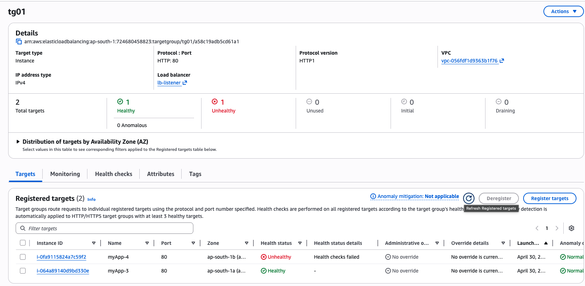

### Subnets — All 4 Listed
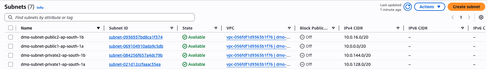

### Public Route Table
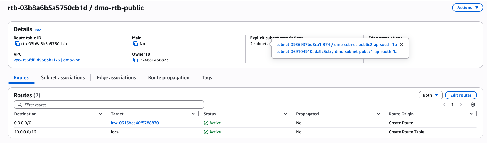

### Private Route Table
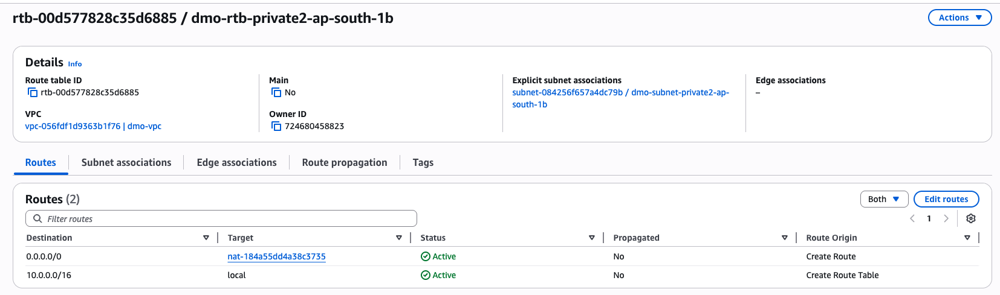

### Internet Gateway
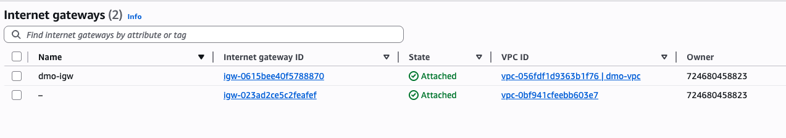

### NAT Gateway
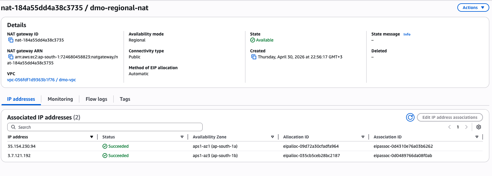

### Security Group — public-sg
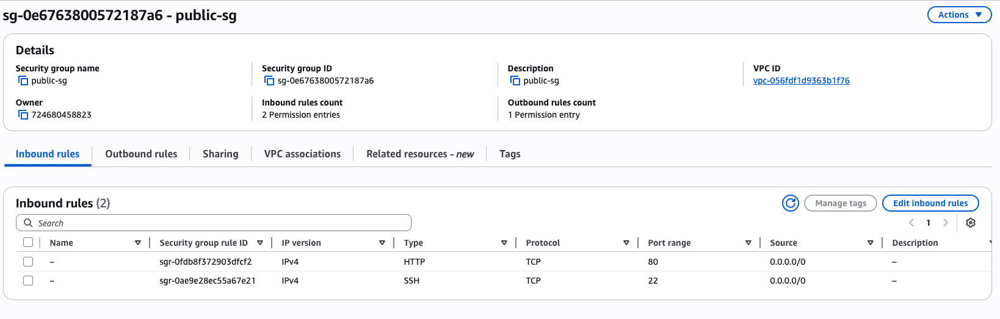

### Target Group — Both Healthy
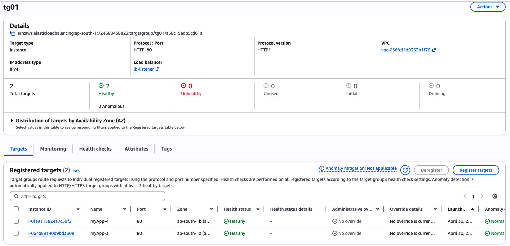

### Load Balancer — Details
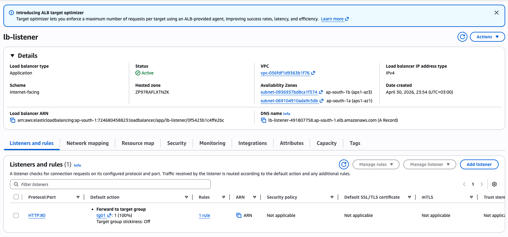

### EC2 Instances
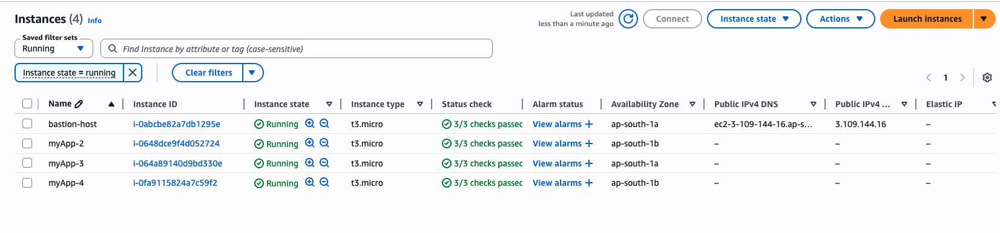

### Round Robin — App 3 (AZ 1a)
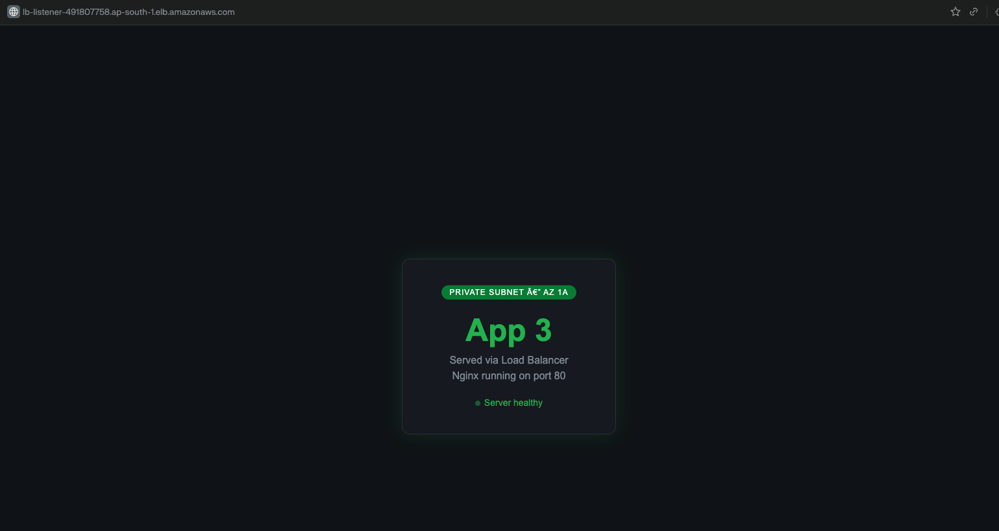

### Round Robin — App 4 (AZ 1b)
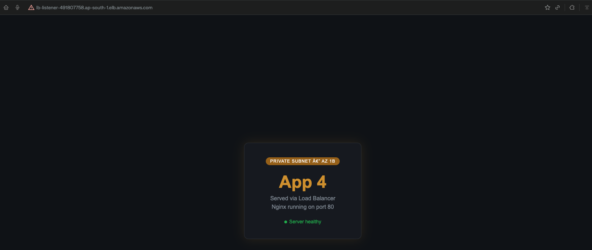

### Failover — 1 Healthy / 1 Unhealthy
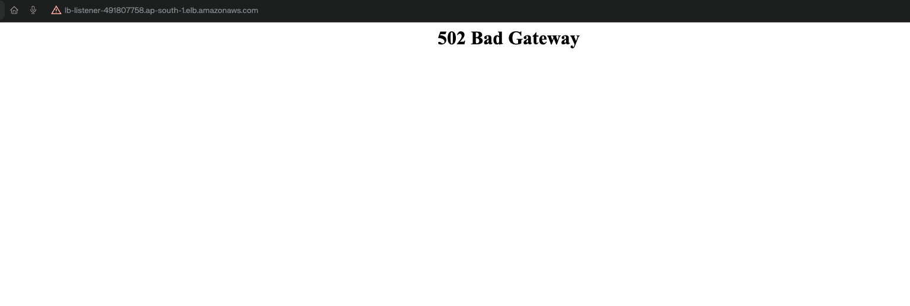

### 502 Bad Gateway — Transition Window
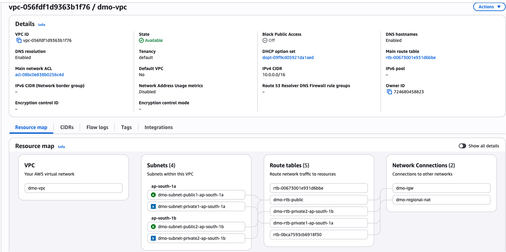

### Round Robin — Both Servers Responding
Refreshing the LB DNS name alternated between App 3 (green, AZ 1a) and App 4 (amber, AZ 1b) — confirming round-robin distribution across AZs.

### Failover Test
Stopped Nginx on myApp-4:
```bash
systemctl stop nginx
```

Target Group immediately showed:
- myApp-3: ✅ Healthy
- myApp-4: ❌ Unhealthy — "Health checks failed"

All traffic routed to myApp-3 only. 502 Bad Gateway appeared briefly during the transition window before the health check completed.

Restarted Nginx:
```bash
systemctl start nginx
```

myApp-4 returned to Healthy. Both servers back in rotation.

---

## ❌ Errors & Fixes

| Error | Cause | Fix |
|---|---|---|
| "Security group invalid for selected VPC" | SG was created in default VPC, not custom VPC | Created new SG inside `dmo-vpc` |
| 502 Bad Gateway briefly during failover | LB health check transition window (~30s) before unhealthy server removed from rotation | Expected behaviour — not an error |

---

## 🧹 Cleanup Order

Deleted in this order to avoid dependency errors:

1. Load Balancer
2. Target Group
3. EC2 Instances (all 4)
4. NAT Gateway (wait for full deletion)
5. Release Elastic IPs
6. Security Groups
7. Route Tables
8. Subnets
9. Detach + delete Internet Gateway
10. Delete VPC

---

## 💰 Cost

| Resource | Cost |
|---|---|
| 4x t3.micro EC2 (~1hr) | ~$0.017 |
| NAT Gateway (~1hr) | ~$0.045 |
| 2x Elastic IPs (attached, ~1hr) | Free |
| ALB (~1hr) | ~$0.008 |
| **Total** | **~$0.07** |

---

## ⏭️ Next

- Coming up: Auto Scaling Group — dynamic server scaling based on load
- ALB + ASG together = true high availability
