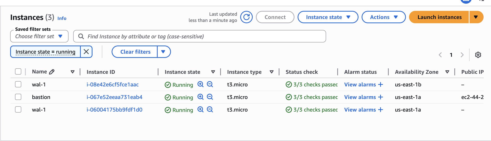
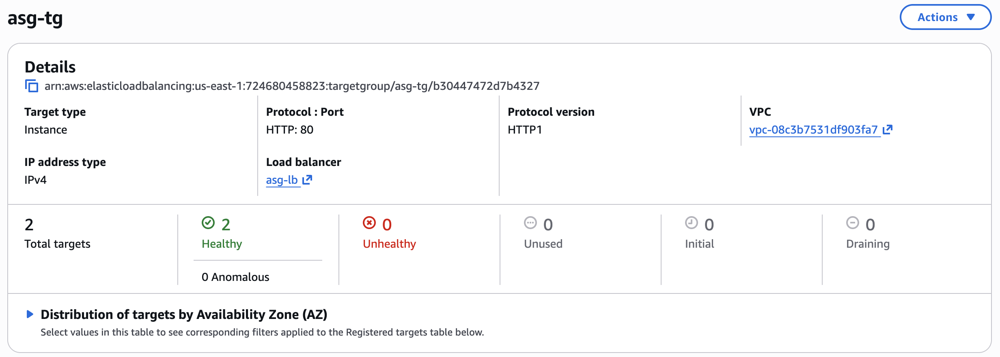
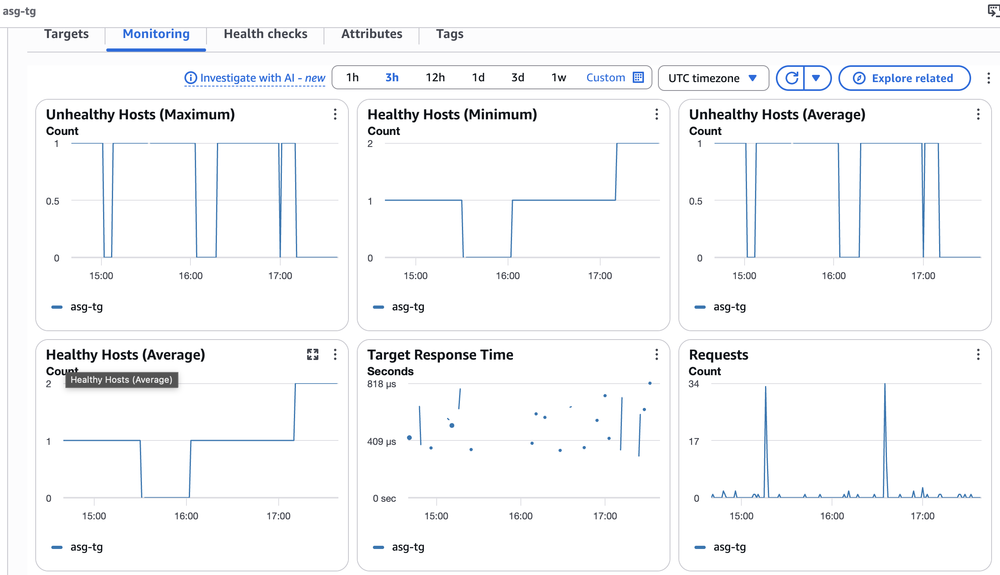
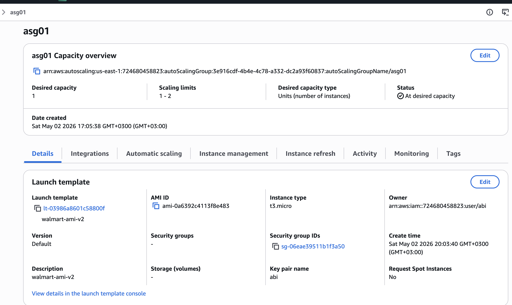
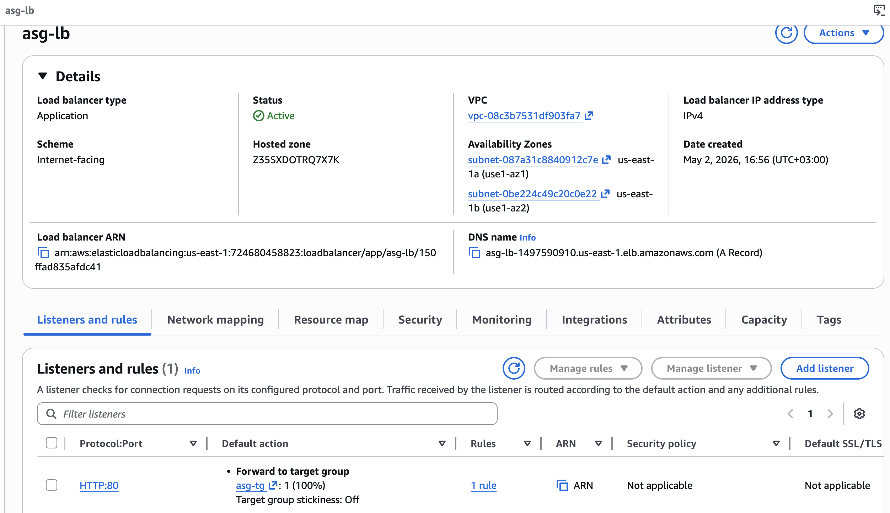
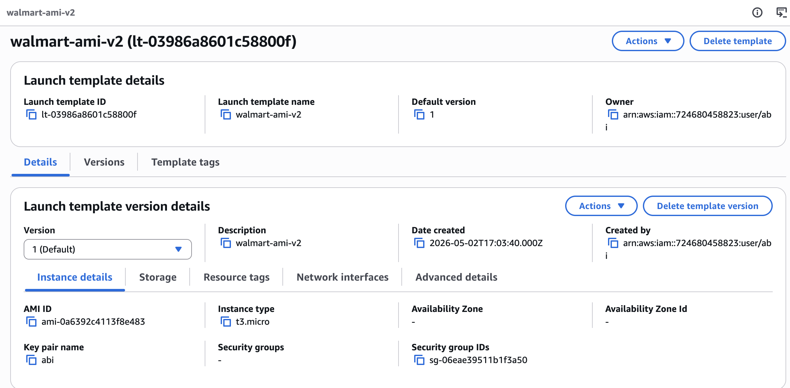
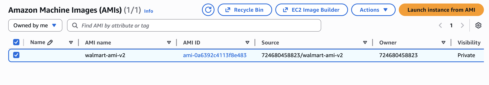
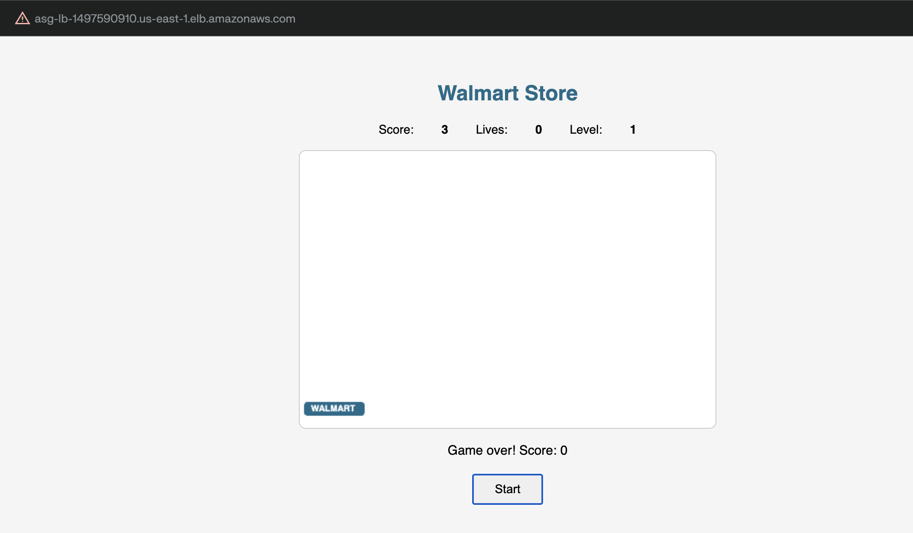
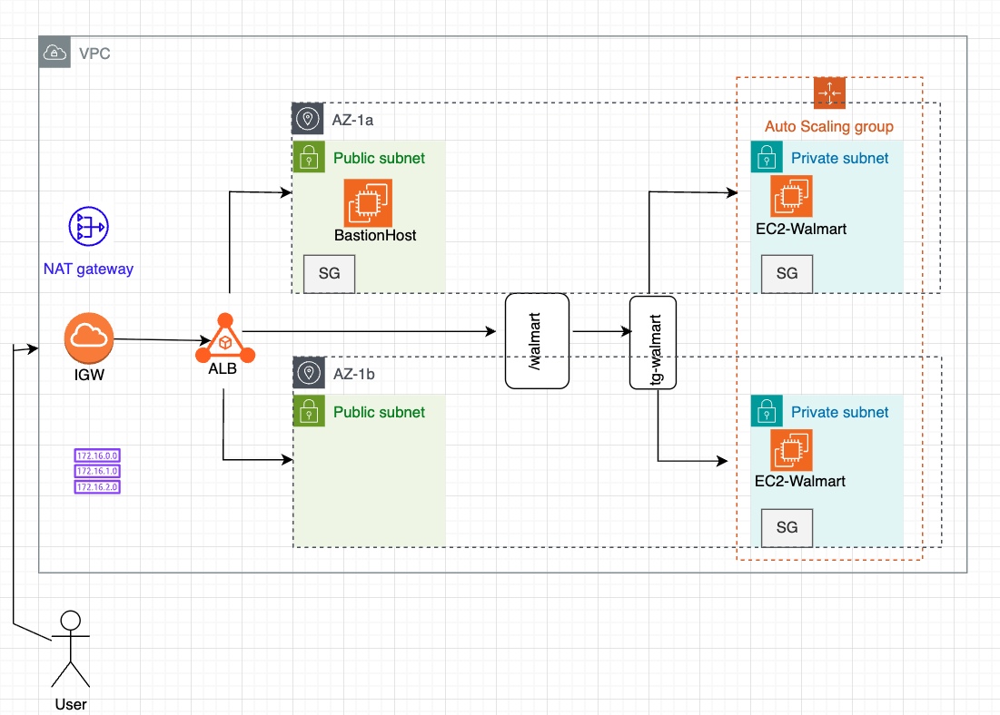

# Lab 04 — ASG + ALB + Private VPC
**Date:** May 2, 2026
**Region:** us-east-1

---

## Resources Created

| Resource | Name | Details |
|---|---|---|
| VPC | asg-vpc | Custom VPC |
| Public Subnet | asg-subnet-public-1a | us-east-1a |
| Public Subnet | asg-subnet-public-1b | us-east-1b |
| Private Subnet | asg-subnet-private-1a | us-east-1a |
| Private Subnet | asg-subnet-private-1b | us-east-1b |
| Internet Gateway | asg-igw | Attached to asg-vpc |
| NAT Gateway | asg-nat | Regional, in public subnet |
| Security Group | asg-sg | Port 80 + 22 open |
| EC2 (Bastion) | bastion | t3.micro, public subnet 1a |
| EC2 (App) | wal-1 | t3.micro, private subnet 1a |
| AMI | walmart-ami-v2 | NGINX + walmart app |
| Launch Template | walmart-ami-v2 | v2 default, no subnet |
| Target Group | asg-tg | HTTP:80, instance type |
| ALB | asg-lb | Internet-facing, public subnets |
| ASG | asg01 | Min:1 Max:2, target tracking 50% CPU |

---

## What I Built

End-to-end private network with ALB + ASG. App servers in private subnets, traffic routed through ALB. ASG manages scaling using a custom AMI with NGINX and the Walmart app pre-installed.

---

## Architecture

```
User
  ↓
IGW → ALB (public subnets: 1a + 1b)
        ↓
    Target Group (asg-tg)
        ↓
EC2 App Servers (private subnets: 1a + 1b)  ← managed by ASG
        ↑
Auto Scaling Group (asg01)
  - Launch Template: walmart-ami-v2
  - Subnets: private-1a + private-1b
  - Scaling: CPU > 50% → add server
```

---

## Step by Step

1. Created VPC (asg-vpc) with public and private subnets across 1a and 1b
2. Attached IGW, created NAT Gateway (regional), configured route tables
3. Launched bastion in public subnet 1a
4. Launched wal-1 in private subnet 1a
5. SSH into wal-1 via bastion → installed NGINX → enabled on boot → deployed walmart.html
6. Verified NGINX running: `systemctl status nginx` → active, `is-enabled` → enabled, `curl localhost` → walmart page
7. Created AMI (walmart-ami-v2) from wal-1 — captured OS + NGINX + app
8. Created Launch Template (walmart-ami-v2) — custom AMI, t3.micro, key: abi, SG: asg-sg, no subnet
9. Created Target Group (asg-tg) — HTTP:80, instance type, asg-vpc
10. Created ALB (asg-lb) — internet-facing, public subnets 1a + 1b, listener HTTP:80 → asg-tg
11. Created ASG (asg01) — LT: walmart-ami-v2, subnets: private-1a + private-1b, attached to asg-tg, desired:1 min:1 max:2, target tracking CPU 50%
12. Verified ALB URL loads walmart game in browser

---

## Key Commands

```bash
# SSH hop via bastion
chmod 400 abi.pem
ssh -i abi.pem ec2-user@<bastion-public-ip>
ssh -i abi.pem ec2-user@<private-ip>

# NGINX setup
sudo dnf install -y nginx
sudo systemctl start nginx
sudo systemctl enable nginx
sudo systemctl is-enabled nginx   # confirm: enabled
curl localhost                    # confirm: walmart page loads

# Deploy app
sudo cp walmart.html /usr/share/nginx/html/index.html

# Stress test (ASG scale-out trigger — testing only)
sudo dnf install -y stress
stress --cpu 4
```

---

## Mistakes & Fixes

| Mistake | Root Cause | Fix |
|---|---|---|
| ASG server unhealthy in TG | Used "Create template from instance" instead of "Create image" — no custom AMI | Created proper AMI from running server with NGINX enabled |
| NGINX not starting on ASG servers | `systemctl enable nginx` not run before AMI creation | Ran enable before AMI, recreated AMI |
| SSH permission denied on bastion hop | abi.pem permissions too open | `chmod 400 abi.pem` |
| Stress test running on bastion not app server | SSH failing silently, commands ran locally | Fixed key permissions first, confirmed hostname changed after SSH |
| ASG not scaling | Scaling limits set to 1-1, no scaling policy created | Set max to 2, created target tracking policy at 50% CPU |
| LT had AZ hardcoded | Selected AZ during template creation | Created new LT version with AZ removed |

---

## Screenshots

**EC2 Instances — wal-1 in 1a, wal-1 in 1b (ASG-created), bastion in 1a**


**Target Group asg-tg — 2 healthy targets, 0 unhealthy**


**TG Monitoring — healthy hosts over time**


**ASG asg01 — capacity overview, scaling limits 1-2, LT walmart-ami-v2**


**ALB asg-lb — internet-facing, DNS name, listener HTTP:80 → asg-tg**


**Launch Template — walmart-ami-v2, t3.micro, key abi, SG asg-sg, no AZ**


**AMI — walmart-ami-v2 available**


**Browser — ALB URL serving walmart game**


**Architecture Diagram**


---

## Cleanup Order

1. ASG (terminates its instances automatically)
2. ALB
3. Target Group
4. Remaining EC2 instances (wal-1 in 1a, bastion)
5. AMI (deregister) + snapshot (delete)
6. NAT Gateway
7. VPC (deletes subnets, route tables, IGW)

---

## Next Steps

- Monday: repeat this full build from scratch without notes — muscle memory
- Network Load Balancer — next topic after ASG
- Document stress test scale-out once ASG scaling policy confirmed working
