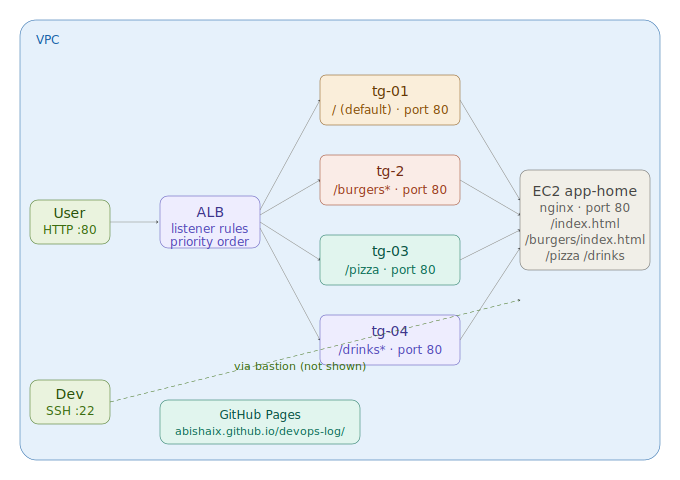

# Lab 06 — Path-Based Routing with ALB (DevOps Diner)
**Date:** May 7, 2026
**Region:** us-east-1
**VPC:** vpc-0157c72869e7bd46c

---

## Resources Created

| Resource | Name | Details |
|---|---|---|
| EC2 | app-home | Public subnet, us-east-1b, nginx |
| ALB | alb | Internet-facing, HTTP:80 |
| Target Group | tg-01 | HTTP:80, default path `/` |
| Target Group | tg-2 | HTTP:80, path `/burgers` |
| Target Group | tg-03 | HTTP:80, path `/pizza` |
| Target Group | tg-04 | HTTP:80, path `/drinks` |

---

## What I Built

Single EC2 instance running nginx serving 4 different HTML pages at different paths. ALB routes incoming requests to the correct target group based on the URL path. All 4 paths confirmed working via browser.

```
User → ALB (HTTP:80)
    │
    ├── /burgers* → tg-2  → EC2 :80 /burgers/index.html
    ├── /pizza    → tg-03 → EC2 :80 /pizza/index.html
    ├── /drinks*  → tg-04 → EC2 :80 /drinks/index.html
    └── default   → tg-01 → EC2 :80 /index.html
```

---

## Architecture Diagrams

### Claude-Generated Diagram



### My Hand-Drawn Diagram (v1 — single server, all TGs pointing to same EC2)


### My Hand-Drawn Diagram (v2 — multi-server architecture with separate App-1, App-2)


---

## Step by Step

1. Launched EC2 `app-home` in public subnet — enabled auto-assign public IPv4
2. SSH'd in, installed nginx, created directory structure:
```bash
sudo mkdir -p /usr/share/nginx/html/burgers
sudo mkdir -p /usr/share/nginx/html/pizza
sudo mkdir -p /usr/share/nginx/html/drinks
```
3. Deployed DevOps Diner HTML to each path:
```bash
sudo cp /usr/share/nginx/html/pizza/index.html /usr/share/nginx/html/burgers/index.html
sudo cp /usr/share/nginx/html/pizza/index.html /usr/share/nginx/html/drinks/index.html
```
4. Created 4 target groups — all HTTP:80, target type: instance, registered `app-home`
5. Created ALB `alb` — internet-facing, added listener rules:
   - Priority 1: Path `/burgers*` → tg-2
   - Priority 2: Path `/pizza` → tg-03
   - Priority 3: Path `/drinks*` → tg-04
   - Default: → tg-01
6. Verified all 4 TGs associated with ALB
7. Hit ALB DNS for each path — all returned correct pages

---

## Key Commands

```bash
# install nginx
sudo yum install nginx -y
sudo systemctl start nginx
sudo systemctl enable nginx

# create path directories
sudo mkdir -p /usr/share/nginx/html/burgers
sudo mkdir -p /usr/share/nginx/html/pizza
sudo mkdir -p /usr/share/nginx/html/drinks

# copy files
sudo cp pizza/index.html /usr/share/nginx/html/burgers/index.html
sudo cp pizza/index.html /usr/share/nginx/html/drinks/index.html
```

---

## Mistakes & Fixes

| Mistake | Cause | Fix |
|---|---|---|
| No public IP on instance | Auto-assign public IPv4 disabled on subnet | Enabled at launch time via Network settings |
| 404 on /pizza | Directory didn't exist on server | Created directories with `mkdir -p` |
| tg-04 showing None associated | Console refresh lag | Refreshed — all 4 TGs showing alb associated |

---

## Screenshots

**ALB Listener Rules — 4 rules: /burgers, /pizza, /drinks, default**


**Target Groups — all 4 TGs associated with ALB**


**TG-01 Health Check — app-home healthy**


**Browser — `/` default path → DevOps Diner home**


**Browser — `/burgers` → Burger Station**


**Browser — `/pizza` → Pizza Lab**


**Browser — `/drinks` → Drinks Bar**


---

## 🌐 Live Demo

[DevOps Diner — Live on GitHub Pages](https://abishaix.github.io/devops-log/docs/devops-diner/)

---

## Cleanup Order

1. ALB `alb`
2. Target groups — `tg-01`, `tg-2`, `tg-03`, `tg-04`
3. EC2 `app-home`

---

## Next Steps

- Repeat with multiple servers per path (one EC2 per TG)
- S3 concepts and practice
