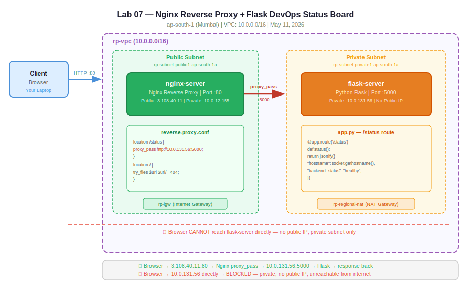

# Practice Log — Nginx Reverse Proxy + Flask DevOps Status Board
**Date:** May 11, 2026
**Region:** ap-south-1 (Mumbai)
**Resources Created:** VPC, 2 Subnets, IGW, NAT Gateway, 2 Route Tables, 2 Security Groups, 2 EC2 Instances

---

## What I Built

A two-server architecture inside a custom VPC. A public EC2 runs Nginx as a reverse proxy — it's the only server exposed to the internet. A private EC2 runs a Python Flask app with a `/status` endpoint. Nginx forwards all incoming requests on port 80 to Flask on port 5000. The Flask server has no public IP and is completely unreachable from the internet directly.

On top of the reverse proxy, I built a live DevOps Status Board — an HTML dashboard served by Nginx that polls the Flask `/status` API and displays the backend's hostname, private IP, uptime, and server time in real time. The browser hits `3.108.40.11` (public), Nginx proxies the API call to `10.0.131.56:5000` (private), and the response comes back through Nginx to the browser. The client never touches the backend directly.

---

## 🏗️ Architecture Diagrams

**Hand-drawn:**


**Claude-generated:**


---

## Network Setup

| Resource | Name | Value |
|---|---|---|
| VPC | rp-vpc | 10.0.0.0/16 |
| Public Subnet | rp-subnet-public1-ap-south-1a | 10.0.0.0/24 |
| Private Subnet | rp-subnet-private1-ap-south-1a | 10.0.1.0/24 |
| Internet Gateway | rp-igw | Attached to rp-vpc |
| NAT Gateway | rp-regional-nat | In public subnet |
| Public Route Table | rp-rtb-public | 0.0.0.0/0 → rp-igw |
| Private Route Table | rp-rtb-private1-ap-south-1a | 0.0.0.0/0 → NAT |

---

## Security Groups

**rp-sg-01 (Nginx server — public)**

| Port | Protocol | Source | Reason |
|---|---|---|---|
| 22 | TCP | 0.0.0.0/0 | SSH access |
| 80 | TCP | 0.0.0.0/0 | HTTP traffic from internet |
| 5000 | TCP | 10.0.12.155/32 | Flask backend access from Nginx only |

**backend-sg (Flask server — private)**

| Port | Protocol | Source | Reason |
|---|---|---|---|
| 22 | TCP | rp-sg-01 | SSH via bastion (Nginx server) |
| 5000 | TCP | 10.0.12.155/32 | Only Nginx private IP can reach Flask |

The port 5000 rule on the backend SG is the critical security piece. Flask is only reachable from the Nginx server's private IP. Nothing from the internet can reach it directly.

---

## EC2 Instances

| Name | Type | Subnet | Public IP | Private IP |
|---|---|---|---|---|
| nginx-server | t3.micro | Public | 3.108.40.11 | 10.0.12.155 |
| flask-server | t3.micro | Private | None | 10.0.131.56 |

---

## Step by Step

**1. SSH into Nginx server (public)**
```bash
ssh -i ~/.ssh/yourkey.pem ec2-user@3.108.40.11
```

**2. Copy key to Nginx server so you can jump to Flask server**
```bash
scp -i ~/.ssh/yourkey.pem ~/.ssh/yourkey.pem ec2-user@3.108.40.11:~/.ssh/
```

**3. From Nginx server, SSH into Flask server using private IP**
```bash
ssh -i ~/.ssh/yourkey.pem ec2-user@10.0.131.56
```

**4. On Flask server — install Flask and create app**
```bash
sudo yum install python3-pip -y
pip3 install flask
cat > /root/app.py << 'EOF'
# (see projects/lab-07-nginx-reverse-proxy/app.py)
EOF
python3 /root/app.py
```

**5. On Nginx server — install Nginx and configure reverse proxy**
```bash
sudo yum install nginx -y
sudo systemctl start nginx
sudo systemctl enable nginx
sudo tee /etc/nginx/conf.d/reverse-proxy.conf << 'EOF'
# (see projects/lab-07-nginx-reverse-proxy/reverse-proxy.conf)
EOF
sudo tee /usr/share/nginx/html/index.html << 'EOF'
# (see projects/lab-07-nginx-reverse-proxy/index.html)
EOF
sudo nginx -t
sudo systemctl restart nginx
```

**6. Test end to end**
```bash
curl http://3.108.40.11/
curl http://3.108.40.11/status
curl http://3.108.40.11/info
```

---

## Terminal Output — Confirmed Working

```bash
abishai@Smyrnix ~ % curl http://3.108.40.11/
{
  "message": "Hello from the private backend!",
  "server": "Flask running on private EC2 @ 10.0.131.56",
  "status": "ok"
}

abishai@Smyrnix ~ % curl http://3.108.40.11/info
{
  "architecture": "Nginx reverse proxy -> Flask backend",
  "backend_port": 5000,
  "backend_private_ip": "10.0.131.56",
  "note": "This response came through Nginx - Flask has no public IP",
  "public_server_private_ip": "10.0.12.155",
  "public_server_public_ip": "3.108.40.11"
}
```

---

## Screenshots

**EC2 instances — nginx-server with public IP, flask-server with no public IP:**


**Nginx active and running:**


**Flask logs showing all requests coming from 10.0.12.155 (Nginx private IP — not the internet):**


**Security group inbound rules — port 5000 restricted to Nginx private IP only:**


**VPC resource map — rp-vpc with public and private subnets, IGW, NAT:**


**DevOps Status Board — live data from private Flask backend through Nginx:**


---

## Key Observations

- Every request in the Flask logs shows source IP `10.0.12.155` — the Nginx private IP. The browser never talked to Flask directly. All traffic went through Nginx.
- The flask-server has no public IP column entry in the EC2 console — confirmed unreachable from internet.
- The hostname returned by Flask was `ip-10-0-131-56.ap-south-1.compute.internal` — AWS internal DNS, only resolvable inside the VPC.
- The NAT gateway allowed the private Flask server to `yum install` packages from the internet outbound, while remaining unreachable inbound.

---

## Troubleshooting

**Issue 1 — `app.py: No such file or directory`**
Ran `python3 app.py` before creating the file. Fixed by using `cat > /root/app.py << 'EOF'` to create it directly on the server.

**Issue 2 — Running as root, `~/` resolves to `/root/` not `/home/ec2-user/`**
After `sudo su`, the home directory shifts to `/root/`. Used explicit path `python3 /root/app.py` instead of relying on relative path.

**Issue 3 — Ran nginx commands on Flask server**
`sudo nginx: command not found` — was on wrong server. Nginx only lives on the public EC2 (`ip-10-0-12-155`). Fixed by switching to the correct terminal.

---

## Cleanup Order

```
1. Terminate EC2 instances (nginx-server + flask-server) → wait for Terminated state
2. Delete security groups (rp-sg-01 + backend-sg)
3. Delete NAT gateway (rp-regional-nat) → wait for Deleted state
4. Detach IGW (rp-igw) from VPC → delete IGW
5. Delete route tables (rp-rtb-public + rp-rtb-private1-ap-south-1a)
6. Delete both subnets
7. Delete VPC (rp-vpc) — always last
```

---

## Cost

- 2x t3.micro EC2 (~$0.02/hr each) × ~1 hour = ~$0.04
- NAT Gateway (~$0.045/hr) × ~1 hour = ~$0.05
- Total: under $0.10 for the full lab

---

## What This Proves

This lab demonstrates the core pattern behind every production web architecture:
- **Public layer** (Nginx) accepts internet traffic and acts as the single entry point
- **Private layer** (Flask) runs business logic, completely hidden from the internet
- **Reverse proxy** bridges the two layers without exposing the backend
- **Security groups** enforce network isolation at the instance level

This is the same pattern AWS ALB uses — except ALB is managed, multi-AZ, and auto-scaling. Building it manually with Nginx first makes the ALB abstraction make sense.

---

## 🔗 GitHub
`https://github.com/abishaix/devops-log`
