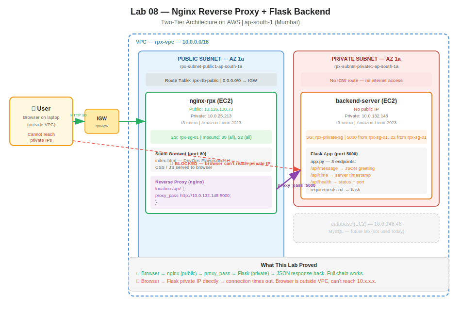

# Practice Log — Nginx Reverse Proxy + Flask Backend
**Date:** May 12, 2026
**Resources Created:** VPC, 4 subnets, IGW, NAT Gateway, 3 route tables, 3 EC2 instances, 2 security groups
**Region:** ap-south-1 (Mumbai)

---

## What I Built

Two-tier web application proving why a reverse proxy is required to connect a public frontend to a private backend. The frontend (nginx) serves a custom "DevOps Playground" dashboard with live API buttons. The backend (Flask) runs on a private EC2 with no public IP. Nginx reverse proxy forwards `/api/*` requests from the browser to the Flask app's private IP — the browser never knows where the backend actually lives.

---

## 🏗️ Architecture Diagrams

**Claude-generated:**



**Hand-drawn:**


---

## Infrastructure Summary

### VPC

| Resource | Name | Details |
|---|---|---|
| VPC | rpx-vpc | 10.0.0.0/16 |
| Public Subnet | rpx-subnet-public1-ap-south-1a | AZ 1a |
| Private Subnet 1 | rpx-subnet-private1-ap-south-1a | AZ 1a |
| Public Subnet 2 | rpx-subnet-public2-ap-south-1b | AZ 1b |
| Private Subnet 2 | rpx-subnet-private2-ap-south-1b | AZ 1b |
| IGW | rpx-igw | Attached to rpx-vpc |
| NAT Gateway | rpx-regional-nat | For private subnet outbound |
| Route Table (public) | rpx-rtb-public | 0.0.0.0/0 → IGW, associated with 2 subnets |
| Route Table (private 1a) | rpx-rtb-private1-ap-south-1a | Local route only |
| Route Table (private 1b) | rpx-rtb-private2-ap-south-1b | Local route only |

### EC2 Instances

| Name | Type | AZ | Public IP | Private IP | Role |
|---|---|---|---|---|---|
| nginx-rpx | t3.micro | ap-south-1b | 13.126.130.73 | 10.0.25.213 | Frontend + reverse proxy |
| backend-server | t3.micro | ap-south-1a | — | 10.0.132.148 | Flask API (port 5000) |
| database | t3.micro | ap-south-1b | — | 10.0.148.48 | Not used in this lab |

### Security Groups

**rpx-sg-01** (attached to nginx-rpx):

| Type | Port | Source | Why |
|---|---|---|---|
| SSH | 22 | 0.0.0.0/0 | EC2 Instance Connect |
| HTTP | 80 | 0.0.0.0/0 | Serve frontend to browser |

**rpx-private-sg** (attached to backend-server, database):

| Type | Port | Source | Why |
|---|---|---|---|
| SSH | 22 | sg-084a5336f83862eb2 (rpx-sg-01) | Bastion access from nginx-rpx only |
| Custom TCP | 5000 | sg-084a5336f83862eb2 (rpx-sg-01) | Flask API — only nginx-rpx can reach it |

The SG-to-SG referencing is the key security pattern here. The backend doesn't allow port 5000 from the internet — only from instances in rpx-sg-01.

---

## Step by Step

### 1. Set up nginx-rpx (public server)

```bash
# SSH in via EC2 Instance Connect
ssh -i abikey.pem ec2-user@13.126.130.73

# Install and start nginx
sudo yum update -y
sudo yum install nginx -y
sudo systemctl start nginx
sudo systemctl enable nginx
sudo systemctl status nginx

# Verify — browse to http://13.126.130.73 → nginx welcome page
```

### 2. Deploy the frontend (DevOps Playground dashboard)

Replaced `/usr/share/nginx/html/index.html` with a custom HTML page featuring:
- "DevOps Playground" title with tagline
- Live status indicators (Frontend / Backend / Reverse Proxy)
- 4 buttons: Fetch Message, Server Time, Health Check, Clear History
- Terminal-style request history log with timestamps and latency

```bash
sudo vi /usr/share/nginx/html/index.html
# Pasted custom HTML
sudo systemctl reload nginx
```

### 3. Set up backend-server (private server)

```bash
# SSH from nginx-rpx (bastion hop)
ssh -i abikey.pem ec2-user@10.0.132.148

# Install Python + pip
sudo yum update -y
sudo yum install python3-pip -y
python3 --version   # Python 3.9.25
pip3 --version      # pip 21.3.1

# Create app directory
mkdir ~/app && cd ~/app

# Create requirements.txt (the proper way — list all dependencies in one file)
cat << 'EOF' > requirements.txt
flask
EOF

# Create the Flask app with 3 API endpoints
cat << 'EOF' > app.py
from flask import Flask, jsonify
from datetime import datetime

app = Flask(__name__)

@app.route('/api/message')
def message():
    return jsonify({
        "status": "success",
        "message": "Hello from Python Backend EC2! 🐍"
    })

@app.route('/api/time')
def server_time():
    return jsonify({
        "status": "success",
        "server_time": datetime.now().strftime("%Y-%m-%d %H:%M:%S"),
        "timezone": "UTC"
    })

@app.route('/api/health')
def health():
    return jsonify({
        "status": "healthy",
        "service": "backend-flask",
        "port": 5000
    })

if __name__ == '__main__':
    app.run(host='0.0.0.0', port=5000)
EOF

# Install dependencies from requirements.txt and run
pip3 install -r requirements.txt
python3 app.py
# * Running on http://10.0.132.148:5000
```

### 4. Test backend locally

From a second SSH session on backend-server:

```bash
curl http://localhost:5000/api/message
# {"message":"Hello from Python Backend EC2! 🐍","status":"success"}

curl http://localhost:5000/api/time
# {"server_time":"2026-05-12 18:47:29","status":"success","timezone":"UTC"}

curl http://localhost:5000/api/health
# {"port":5000,"service":"backend-flask","status":"healthy"}
```

All three endpoints returning JSON. ✅

### 5. Test cross-subnet connectivity from nginx-rpx

```bash
# From nginx-rpx
curl http://10.0.132.148:5000/api/message
# {"message":"Hello from Python Backend EC2! 🐍","status":"success"}
```

This initially failed — the private SG had no port 5000 rule. Added `Custom TCP / 5000 / source: rpx-sg-01` to rpx-private-sg, then it worked.

### 6. Configure nginx reverse proxy

```bash
sudo vi /etc/nginx/nginx.conf
```

Added inside the `server` block, above the existing `location /` block:

```nginx
location /api/ {
    proxy_pass http://10.0.132.148:5000;
    proxy_set_header Host $host;
    proxy_set_header X-Real-IP $remote_addr;
}
```

```bash
sudo nginx -t
# nginx: the configuration file /etc/nginx/nginx.conf syntax is ok
# nginx: configuration file /etc/nginx/nginx.conf test is successful

sudo systemctl reload nginx
```

### 7. Test reverse proxy from nginx-rpx

```bash
curl http://localhost/api/message
# {"message":"Hello from Python Backend EC2! 🐍","status":"success"}

curl http://localhost/api/time
# {"server_time":"2026-05-12 18:59:43","status":"success","timezone":"UTC"}

curl http://localhost/api/health
# {"port":5000,"service":"backend-flask","status":"healthy"}
```

All three endpoints now accessible through nginx on port 80. ✅

### 8. Test from browser — the moment of truth

Opened `http://13.126.130.73` → clicked all three buttons:
- 💬 Fetch Message → ✅ `{"message":"Hello from Python Backend EC2! 🐍","status":"success"}` (228ms)
- ⏰ Server Time → ✅ `{"server_time":"2026-05-12 19:00:16","status":"success","timezone":"UTC"}` (325ms)
- ❤️ Health Check → ✅ `{"port":5000,"service":"backend-flask","status":"healthy"}` (222ms)

All three status dots green. Full chain working: Browser → nginx → proxy_pass → Flask → JSON → back to browser.

### 9. Prove the "wrong way" fails (Task 2)

Modified `index.html` to call the backend's private IP directly from the browser:

```bash
sudo sed -i "s|fetch(endpoint)|fetch('http://10.0.132.148:5000' + endpoint)|g" /usr/share/nginx/html/index.html
```

Result: all three buttons returned `HTTP 404 — backend unreachable`. Status dots turned red.

Why it fails: the browser runs on the user's laptop (outside the VPC). It cannot reach `10.0.132.148` because that's a private IP with no internet route. The request never leaves the user's network.

Reverted:

```bash
sudo sed -i "s|fetch('http://10.0.132.148:5000' + endpoint)|fetch(endpoint)|g" /usr/share/nginx/html/index.html
```

Green dots restored. ✅

---

## Screenshots

### AWS Console


### Terminal


### DevOps Playground Dashboard


---

## Troubleshooting

### Issue 1: curl from nginx-rpx to backend timed out

**Symptom:** `curl http://10.0.132.148:5000/api/message` hung from nginx-rpx.

**Root cause:** rpx-private-sg had no inbound rule for port 5000. Initially added the rule to rpx-sg-01 by mistake (wrong SG).

**Fix:** Added `Custom TCP / 5000 / source: sg-084a5336f83862eb2 (rpx-sg-01)` to **rpx-private-sg** (the backend's SG).

**Lesson:** Always check which SG you're editing. The source should be the caller's SG, and the rule goes on the target's SG.

### Issue 2: `python app.py` — command not found

**Symptom:** `python app.py` returned `-bash: python: command not found`.

**Fix:** Amazon Linux 2023 uses `python3`, not `python`. Used `python3 app.py`.

### Issue 3: `nginx -t` permission denied

**Symptom:** Running `nginx -t` without sudo returned permission errors for `/var/log/nginx/error.log` and `/run/nginx.pid`.

**Fix:** Always use `sudo nginx -t`. The config was fine — it was just a permission issue on the test command.

---

## Cleanup

**Deletion order (dependencies first, VPC last):**

1. ⬜ Terminate EC2: nginx-rpx, backend-server, database → wait for Terminated state
2. ⬜ Delete Security Groups: rpx-sg-01, rpx-private-sg
3. ⬜ Delete NAT Gateway: rpx-regional-nat → wait for Deleted state
4. ⬜ Release Elastic IP (if any)
5. ⬜ Detach and delete IGW: rpx-igw
6. ⬜ Delete Route Tables: rpx-rtb-public, rpx-rtb-private1-ap-south-1a, rpx-rtb-private2-ap-south-1b
7. ⬜ Delete Subnets (all 4)
8. ⬜ Delete VPC: rpx-vpc

**Confirm all resources deleted before closing AWS console.**

---

## Cost

- 3x t3.micro EC2 instances running ~2 hours: ~$0.10
- NAT Gateway: ~$0.05/hr × 2 hrs = ~$0.10
- Data transfer: negligible
- **Estimated total: ~$0.25**

---

## Key Takeaways

1. **The browser is always outside the VPC.** JavaScript runs on the user's laptop, not on AWS. It can only reach public IPs.
2. **A reverse proxy bridges the gap.** It has a foot in both worlds: a public IP the browser can reach, and a private IP inside the VPC that can reach the backend.
3. **Relative URLs are the correct pattern.** `fetch("/api/message")` means "same host that served this page" — which is nginx. Hardcoding any IP in the frontend is wrong.
4. **SG-to-SG referencing is the correct security model.** The backend allows port 5000 only from rpx-sg-01, not from the internet. If you add more frontend instances with that SG, they automatically get access.
5. **`requirements.txt` is the Python deployment standard.** List all dependencies in one file, install with `pip install -r requirements.txt`. Repeatable, shareable, automatable.

---

## Questions Still Open

- How does an ALB replace the nginx reverse proxy in this setup?
- What changes when you add a database tier (MySQL on the third EC2)?
- How do you run Flask in production (gunicorn/uwsgi instead of the dev server)?
- Task 4 from class: how to use Jinja2 to render HTML server-side instead of serving static files?

---

## Next Steps

- Complete cleanup checklist above
- Push all screenshots to `screenshots/lab-08/`
- Try replacing nginx reverse proxy with an ALB (external) for comparison
- Add MySQL on the database EC2 to complete three-tier architecture
- Explore gunicorn for production Flask deployment
