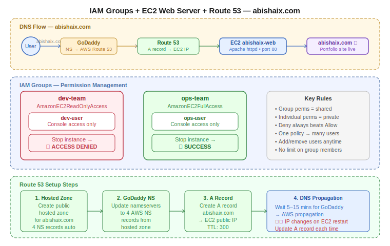

# Practice Log — IAM Groups, EC2 Web Server, and Route 53
**Date:** May 19, 2026
**Resources Created:** EC2 instance, IAM Groups, IAM Users, Route 53 Hosted Zone, S3 bucket
**Region:** ap-south-1 (Mumbai)

---

## What I Built

A complete end-to-end lab combining IAM permission management and DNS routing. Deployed an Apache web server on EC2, created IAM groups with scoped permissions to verify access control, set up a Route 53 hosted zone, and pointed `abishaix.com` to the EC2 instance via GoDaddy nameserver delegation.

---

## 🏗️ Architecture Diagrams

**Claude-generated:**



**Hand-drawn:**


---

## Infrastructure Summary

| Resource | Name | Details |
|---|---|---|
| EC2 | abishaix-web | t3.micro, Amazon Linux 2023, ap-south-1a |
| Security Group | launch-wizard-1 | Port 80 (HTTP), Port 22 (SSH) open |
| IAM Group | dev-team | AmazonEC2ReadOnlyAccess |
| IAM Group | ops-team | AmazonEC2FullAccess |
| IAM User | dev-user | Member of dev-team |
| IAM User | ops-user | Member of ops-team |
| Route 53 | abishaix.com | Public hosted zone |
| DNS Record | A record | abishaix.com → EC2 public IP |
| S3 | abishaix-devops-lab | ap-south-1, for peer access testing |

---

## Step by Step

**Step 1 — Launch EC2 instance**

Launched `abishaix-web` with Amazon Linux 2023, t3.micro, in default VPC. Security group allowed HTTP (80) and SSH (22) from anywhere.

**Step 2 — Connect and install Apache**

Connected via EC2 Instance Connect and ran:

```bash
sudo yum update -y
sudo yum install -y httpd
sudo systemctl start httpd
sudo systemctl enable httpd
```

Created the web page:

```bash
echo "<h1>Hello from abishaix.com — hosted on AWS EC2</h1>" | sudo tee /var/www/html/index.html
```

Deployed the full portfolio site using vi:

```bash
sudo vi /var/www/html/index.html
```

**Step 3 — Create IAM Groups**

Created two groups in IAM:
- `dev-team` → attached `AmazonEC2ReadOnlyAccess`
- `ops-team` → attached `AmazonEC2FullAccess`

**Step 4 — Create IAM Users**

Created `dev-user` → added to `dev-team`
Created `ops-user` → added to `ops-team`

Both given console access with custom passwords.

Console sign-in URL: `https://abi01-aws.signin.aws.amazon.com/console`

**Step 5 — Verify permissions**

Logged in as `dev-user` → attempted to stop EC2 instance → **access denied** ✅

Logged in as `ops-user` → attempted to stop EC2 instance → **succeeded** ✅

**Step 6 — Create Route 53 Hosted Zone**

Navigated to Route 53 → Create hosted zone:
- Domain: `abishaix.com`
- Type: Public hosted zone

AWS generated 4 nameservers:
```
ns-1810.awsdns-34.co.uk
ns-473.awsdns-59.com
ns-783.awsdns-33.net
ns-1107.awsdns-10.org
```

**Step 7 — Update GoDaddy nameservers**

GoDaddy → DNS → Nameservers → Change → Enter my own nameservers → entered all 4 AWS nameservers.

**Step 8 — Create A record**

Route 53 → Hosted zone → Create record:
- Type: A
- Name: (blank — root domain)
- Value: EC2 public IP
- TTL: 300
- Routing: Simple

**Step 9 — Verify domain**

Opened `http://abishaix.com` in browser → portfolio site loaded ✅

**Note:** EC2 public IP changes on every stop/start. Update the Route 53 A record whenever the instance is restarted. Fix: assign an Elastic IP to make it permanent.

---

## Screenshots

EC2 instance connected via EC2 Instance Connect:


Apache installed and enabled:


IAM users created:


dev-user denied stopping instance:


ops-user successfully stopped instance:


Route 53 hosted zone with NS records:


GoDaddy nameservers updated to AWS:


Route 53 A record created:


abishaix.com live in browser:


---

## Troubleshooting

**Issue 1: Browser showing blank page after Apache install**
- Cause: Browser was auto-upgrading to HTTPS, not HTTP
- Fix: Explicitly typed `http://` in the URL

**Issue 2: EC2 Instance Connect failed via SCP**
- Cause: Corporate/office network blocking outbound SSH port 22
- Fix: Used EC2 Instance Connect in browser instead of local SCP

**Issue 3: EC2 public IP changed after restart**
- Cause: Auto-assigned public IPs change on every stop/start
- Fix: Updated Route 53 A record with new IP
- Permanent fix: Assign an Elastic IP

**Issue 4: Route 53 A record name field showing error**
- Cause: Tried entering `@` as root domain indicator
- Fix: Left the name field blank — AWS auto-fills as root domain

**Issue 5: httpd not running after EC2 restart**
- Cause: httpd not enabled for auto-start
- Fix: `sudo systemctl enable httpd` — now starts automatically on boot

---

## Cleanup

Deletion order followed:

1. Terminated EC2 instance `abishaix-web`
2. Deleted IAM users `dev-user` and `ops-user`
3. Deleted IAM groups `dev-team` and `ops-team`
4. Kept Route 53 hosted zone — needed for future labs
5. S3 bucket emptied and deleted

---

## Cost

| Resource | Cost |
|---|---|
| EC2 t3.micro | Free tier (750 hrs/month) |
| Route 53 hosted zone | $0.50/month — kept for future labs |
| S3 storage | Free tier |
| Data transfer | Minimal — negligible |

---

## Key Learnings

- IAM Groups are the right way to manage permissions at scale — attach once to group, add users to group
- Individual user permissions and group permissions are independent — they don't leak between group members
- Route 53 A record + GoDaddy nameserver delegation = custom domain pointing to AWS
- EC2 public IP changes on restart — Elastic IP solves this permanently
- `sudo systemctl enable httpd` is required for Apache to survive reboots
- EC2 Instance Connect uses AWS's own IP range — opening SSH to 0.0.0.0/0 is required for it in practice (use bastion host or SSM in production)
