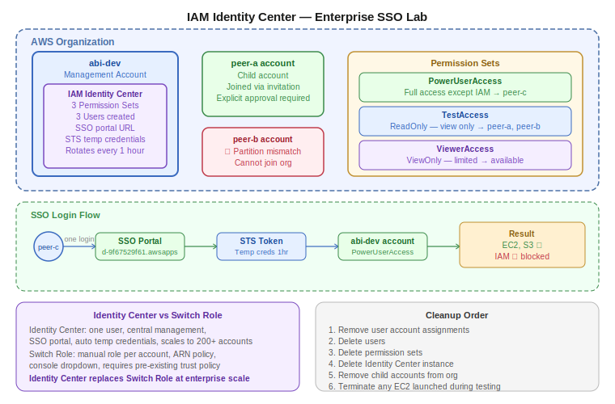

# Practice Log — IAM Identity Center and AWS SSO
**Date:** May 19, 2026
**Resources Created:** AWS Organization, IAM Identity Center, 3 Permission Sets, 3 Users, Cross-account assignments
**Region:** ap-south-1 (Mumbai) — Identity Center global instance

---

## What I Built

A real enterprise-scale access control setup using AWS IAM Identity Center. Created an AWS Organization with my account as the management account, added a peer's account as a child account, enabled Identity Center, created permission sets, onboarded three peers as users, and verified each permission level works correctly — read-only access blocked from creating resources, PowerUserAccess blocked from IAM. All peers accessed my account through a single SSO portal URL without any per-account credentials.

---

## 🏗️ Architecture Diagrams





*(Hand-drawn diagram — to be added)*

---

## Infrastructure Summary

| Resource | Name | Details |
|---|---|---|
| AWS Organization | abi-org | Management account: abi-dev |
| Child account | peer-a account | Joined via invitation — accepted |
| IAM Identity Center | ssoins-659572adae22ebef | ap-south-1, global instance |
| Permission Set 1 | PowerUserAccess | EC2, S3, most services — no IAM |
| Permission Set 2 | TestAccess | ReadOnlyAccess — view only |
| Permission Set 3 | ViewerAccess | ViewOnlyAccess — limited view |
| User 1 | peer-a | Assigned: abi-dev + TestAccess |
| User 2 | peer-b | Assigned: abi-dev + TestAccess |
| User 3 | peer-c | Assigned: abi-dev + PowerUserAccess |
| SSO Portal | https://d-9f67529f61.awsapps.com/start | Single login URL for all users |

---

## Step by Step

**Step 1 — Create AWS Organization**

Navigated to AWS Organizations → Create organization. My account (`abi-dev`) automatically became the management account.

**Step 2 — Add peer account to organization**

Organizations → AWS accounts → Add an AWS account → Invite existing account → entered peer-a's account ID.

Peer accepted the invitation from their AWS console under Organizations → Invitations.

**Note:** Account invitation requires explicit approval from the account holder. AWS enforces this — you cannot add an account without the owner accepting. Also, accounts must be in the same AWS partition — peer-b's account failed to join due to a partition mismatch (different AWS partition region). This is a hard AWS restriction.

**Step 3 — Enable IAM Identity Center**

Navigated to IAM Identity Center → Enable. Instance created in ap-south-1.

**Step 4 — Create Permission Sets**

Created 3 permission sets using predefined AWS managed policies:

| Permission Set | Policy | Use case |
|---|---|---|
| PowerUserAccess | PowerUserAccess | Developers — full access except IAM |
| TestAccess | ReadOnlyAccess | QA/Testers — view only |
| ViewerAccess | ViewOnlyAccess | Auditors — limited view |

**Step 5 — Create Users**

Created 3 users in Identity Center (not IAM console):
- Each user created with a generated one-time password
- One-time password forces a new password on first login
- Users created as "Manual" type — as opposed to "Synced" from external directory (Okta, Entra ID)

**Step 6 — Assign users to accounts**

For each user: Users → select user → AWS accounts tab → Assign accounts → select account → select permission set → Submit.

| User | Account | Permission Set |
|---|---|---|
| peer-a | abi-dev | TestAccess |
| peer-b | abi-dev | TestAccess |
| peer-c | abi-dev | PowerUserAccess |

**Step 7 — Users log in via SSO portal**

Shared portal URL with each user privately:
```
https://d-9f67529f61.awsapps.com/start
```

Each user logs in → sees assigned accounts → clicks account → selects permission set role → inside the account.

**Step 8 — Verify permissions**

peer-c (PowerUserAccess):
- Created S3 bucket ✅
- Launched EC2 instance ✅
- Tried to create IAM user → **access denied** ❌
- Tried to list IAM policies → **access denied** ❌

peer-a (TestAccess):
- Browsed S3 buckets ✅
- Browsed EC2 instances ✅
- Tried to create S3 bucket → **access denied** ❌

peer-b (TestAccess):
- Browsed EC2 dashboard ✅
- Browsed S3 buckets ✅

**Step 9 — Create Groups**

Created two groups in Identity Center:
- `dev-engineers` — for developer users
- `qa-testers` — for QA users

Groups allow managing permissions at team level instead of per-user.

**Step 10 — Cleanup**

Removed all user assignments, deleted users, deleted permission sets, deleted Identity Center instance. Removed peer accounts from AWS Organization.

---

## Screenshots

Identity Center enabled:


Identity Center dashboard:


Permission sets created:


Users list (3 users):


AWS Organization with peer account joined:


Assignment provisioning success:


peer-c SSO portal showing abi-dev account:


peer-c PowerUserAccess — EC2 instances running:


peer-c PowerUserAccess — IAM access denied:


peer-a TestAccess — S3 create bucket denied:


Switch Role form (requires pre-existing role with trust policy):


Identity Center settings before deletion:


---

## Troubleshooting

**Issue 1: peer-b account failed to join AWS Organization**
- Error: "You can only join an organization that operates in the same AWS partition"
- Cause: peer-b's AWS account was created in a different AWS partition
- Fix: Cannot be resolved — hard AWS restriction. peer-b accessed abi-dev via Identity Center user only (no org membership needed for SSO access)

**Issue 2: Tried to create new account instead of inviting existing**
- Error: `EMAIL_ALREADY_EXISTS`
- Cause: Used "Create new account" instead of "Invite existing account"
- Fix: Always use "Invite existing account" when the account already exists

**Issue 3: peer-a saw their own empty account instead of abi-dev**
- Cause: peer-a was assigned to their own account first. After reassigning to abi-dev, they clicked their own account in the SSO portal
- Fix: Updated assignment to abi-dev. Told peer-a to select abi-dev from the portal account list

**Issue 4: Padma's AWS error "It's not you, it's us"**
- Cause: Temporary AWS-side error on SSO portal login
- Fix: Closed browser, opened fresh incognito window, logged in again

**Issue 5: peer-c asked about billing upgrade email**
- Cause: AWS automatically upgrades free tier accounts to "AWS Free Tier for Organizations" when joining an org
- Clarification: This is just a plan name change — Free Tier limits still apply. No charges unless Free Tier is exceeded.

---

## Key Learnings

- Identity Center users are created once in the management account — not in each account separately
- Permission sets are reusable templates — create once, assign to any user + account combination
- STS generates temporary credentials automatically on SSO login — rotates every 1 hour
- Credentials are never stored in `~/.aws/credentials` with Identity Center — stored as tokens in `~/.aws/sso/cache/`
- "Manual" user type = created directly in Identity Center. "Synced" = from external directory (Entra ID, Okta)
- AWS partition mismatch is a hard restriction — accounts in different partitions cannot join the same organization
- PowerUserAccess = full AWS access except IAM — developers can build but cannot touch access control
- Switch Role requires a pre-existing IAM role with trust policy in the target account — Identity Center replaces this need entirely
- One SSO URL, multiple accounts, zero per-account credentials — this is enterprise-scale access control

---

## Cleanup Order

1. Remove user account assignments (Users → AWS accounts tab → remove)
2. Delete all users
3. Delete all permission sets
4. Delete IAM Identity Center instance (Settings → Delete)
5. Remove child accounts from AWS Organization
6. Terminate any EC2 instances launched during peer testing

---

## Cost

| Resource | Cost |
|---|---|
| IAM Identity Center | Free |
| AWS Organizations | Free |
| S3 buckets (test) | Free tier |
| EC2 instances (peer testing) | Free tier — terminated same day |
