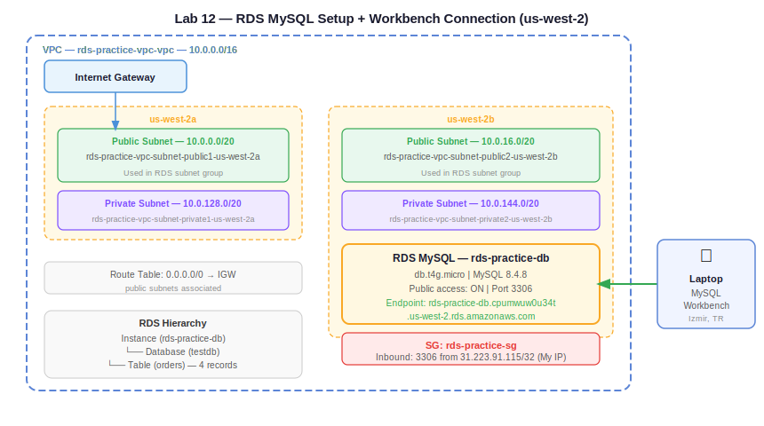

# Practice Log — Lab 12: RDS MySQL Setup + Workbench Connection
**Date:** May 28, 2026
**Resources Created:** VPC, subnets, RDS subnet group, RDS MySQL instance, security group
**Region:** us-west-2 (Oregon)

---

## What I Built

A public RDS MySQL instance inside a custom VPC, connected via MySQL Workbench from my laptop. Created a database, table, and inserted records to verify end-to-end connectivity and understand the RDS hierarchy: instance → database → table → records.

---

## Infrastructure Summary

| Resource | Name | Details |
|---|---|---|
| VPC | rds-practice-vpc-vpc | 10.0.0.0/16, us-west-2 |
| Public Subnet 1 | rds-practice-vpc-subnet-public1-us-west-2a | 10.0.0.0/20, us-west-2a |
| Public Subnet 2 | rds-practice-vpc-subnet-public2-us-west-2b | 10.0.16.0/20, us-west-2b |
| Private Subnet 1 | rds-practice-vpc-subnet-private1-us-west-2a | 10.0.128.0/20, us-west-2a |
| Private Subnet 2 | rds-practice-vpc-subnet-private2-us-west-2b | 10.0.144.0/20, us-west-2b |
| RDS Subnet Group | rds-practice-subnet-group | public subnets, 2 AZs |
| RDS Instance | rds-practice-db | db.t4g.micro, MySQL 8.4.8 |
| Security Group | rds-practice-sg | inbound 3306 from my IP |
| AZ | us-west-2b | single AZ, free tier |

---

## 🏗️ Architecture Diagrams

**Claude-generated:**



**Hand-drawn:**


---

## Step by Step

**1. Create VPC**

Used VPC and more wizard:
- Name: `rds-practice-vpc`
- CIDR: `10.0.0.0/16`
- 2 AZs (us-west-2a, us-west-2b)
- 2 public + 2 private subnets
- No NAT gateway
- IGW created and attached automatically

Note: originally created in us-east-1 but instance type dropdown bug in us-east-1 forced move to us-west-2. Recreated VPC in us-west-2.

**2. Create RDS Subnet Group**

RDS → Subnet groups → Create:
- Name: `rds-practice-subnet-group`
- VPC: `rds-practice-vpc-vpc`
- AZs: us-west-2a, us-west-2b
- Subnets: both public subnets (practice only — production uses private)

**3. Create RDS Instance**

RDS → Create database → Standard create:
- Engine: MySQL
- Template: Free tier
- Deployment: Single-AZ
- Identifier: `rds-practice-db`
- Username: `admin`
- Instance: `db.t4g.micro` (free tier in us-west-2)
- Storage: 20 GB
- VPC: `rds-practice-vpc-vpc`
- Subnet group: `rds-practice-subnet-group`
- Public access: Yes (practice only)
- New SG: `rds-practice-sg`

**4. Add inbound rule to security group**

EC2 → Security Groups → `rds-practice-sg` → Edit inbound rules:
- Type: MySQL/Aurora
- Port: 3306
- Source: My IP (31.223.91.115/32)

**5. Connect via MySQL Workbench**

New connection:
- Method: Standard TCP/IP (not SSH)
- Hostname: `rds-practice-db.cpumwuw0u34t.us-west-2.rds.amazonaws.com`
- Port: 3306
- Username: admin
- Password: stored in keychain

Test connection → success (version warning for 8.4.8 — ignored, works fine).

**6. Create database and table**

```sql
CREATE DATABASE testdb;
```

```sql
CREATE TABLE testdb.orders (
    order_id INT AUTO_INCREMENT PRIMARY KEY,
    customer_name VARCHAR(100),
    product_name VARCHAR(100),
    quantity INT,
    price DECIMAL(10,2),
    order_date TIMESTAMP DEFAULT CURRENT_TIMESTAMP,
    status VARCHAR(50)
);
```

**7. Insert records**

```sql
INSERT INTO testdb.orders (customer_name, product_name, quantity, price, status)
VALUES
  ('Abishai', 'MacBook Pro', 1, 2499.00, 'Shipped'),
  ('Rahul', 'iPhone 15', 2, 999.00, 'Processing'),
  ('Priya', 'AirPods Pro', 1, 249.00, 'Delivered'),
  ('Kiran', 'iPad Air', 1, 749.00, 'Pending');
```

**8. Verify records**

```sql
SELECT * FROM testdb.orders;
```

Returned 4 rows — order_id auto-incremented 1–4, order_date populated automatically by timestamp default.

---

## Screenshots

| Screenshot | Description |
|---|---|
|  | VPC resource map — 4 subnets, IGW, route tables |
|  | RDS subnet group — 2 public subnets across 2 AZs |
|  | Security group — inbound 3306 from my IP |
|  | RDS instance — Available, db.t4g.micro, us-west-2b |
|  | RDS security group and replication panel |
|  | MySQL Workbench — successful connection to RDS |
|  | Workbench schema browser — testdb → orders table |
|  | SELECT * result — 4 records confirmed in RDS |

---

## Troubleshooting

**Issue 1 — Instance type dropdown empty in us-east-1**
RDS create database form showed empty instance type dropdown with "This field is required" error. Typed `db.t3.micro` manually — didn't populate. Same issue the instructor hit in class.

Fix: switched to us-west-2 (Oregon). Dropdown loaded correctly. Instance came up as `db.t4g.micro` (newer ARM generation, also free tier eligible).

**Issue 2 — Wrong connection method in Workbench**
Selected "Standard TCP/IP over SSH" by mistake — SSH tunnel method is for private RDS via bastion host (Day 33 pattern). Got "Invalid hostname URI" error because my IP ended up in the hostname field.

Fix: changed connection method to "Standard TCP/IP". Cleared hostname field, entered RDS endpoint correctly.

**Issue 3 — Version compatibility warning**
Workbench showed warning: MySQL 8.4.8 not fully supported (Workbench tested against 5.6, 5.7, 8.0).

Fix: clicked "Continue Anyway" — all queries ran without issues. This is a Workbench version lag, not an RDS problem.

---

## Key Observations

- RDS has no console UI to browse data — AWS manages the server, you own the data. Only way to view records is via a DB client (Workbench, CLI, or app code)
- `order_date` populated automatically because of `DEFAULT CURRENT_TIMESTAMP` — never passed it in the INSERT
- `order_id` auto-incremented from 1 to 4 — never passed it either, handled by `AUTO_INCREMENT PRIMARY KEY`
- Public access on RDS = IP assigned to the instance. Still need SG inbound rule on 3306 to actually allow traffic through
- RDS instance type in us-east-1 free tier = `db.t3.micro`. In us-west-2 free tier = `db.t4g.micro` (ARM-based, equivalent performance)

---

## Cleanup

Delete in this order (dependencies first):

1. RDS instance `rds-practice-db` → Actions → Delete → uncheck final snapshot → type `delete me` → confirm
2. Wait until instance is fully deleted
3. RDS subnet group `rds-practice-subnet-group` → Delete
4. Security group `rds-practice-sg` → Delete
5. VPC `rds-practice-vpc-vpc` → Actions → Delete (deletes subnets, route tables, IGW automatically)

Do not delete until Day 32 lab is complete — read replica lab uses this same instance.

---

## Cost

- RDS db.t4g.micro: free tier (750 hours/month for 12 months)
- Storage 20 GB gp2: free tier (20 GB/month)
- No NAT gateway: $0
- Data transfer: minimal, negligible

**Estimated cost: $0 (within free tier)**
