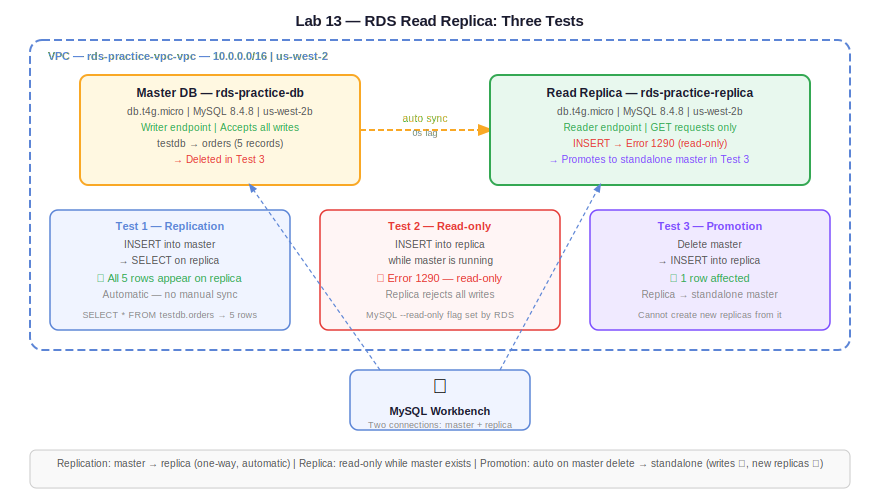

# Practice Log — Lab 13: RDS Read Replicas
**Date:** May 28, 2026
**Resources Created:** RDS Read Replica (rds-practice-replica)
**Region:** us-west-2 (Oregon)

---

## What I Built

Created a read replica from an existing RDS MySQL master instance. Tested all three replication scenarios: data sync from master to replica, read-only enforcement on replica, and master deletion with replica promotion to standalone master.

---

## Infrastructure Summary

| Resource | Name | Details |
|---|---|---|
| Master DB (source) | rds-practice-db | db.t4g.micro, MySQL 8.4.8, us-west-2b |
| Read Replica | rds-practice-replica | db.t4g.micro, MySQL 8.4.8, us-west-2b |
| VPC | rds-practice-vpc-vpc | 10.0.0.0/16 |
| Security Group | rds-practice-sg | Inbound 3306 from my IP |
| Subnet Group | rds-practice-subnet-group | Public subnets, 2 AZs |

---

## 🏗️ Architecture Diagrams

**Claude-generated:**



**Hand-drawn:**


---

## Step by Step

**1. Create read replica from existing master**

RDS console → Databases → `rds-practice-db` → Actions → Create read replica:
- DB instance identifier: `rds-practice-replica`
- Instance class: `db.t4g.micro`
- Region: us-west-2 (same region)
- Public access: Publicly accessible
- Subnet group: `rds-practice-subnet-group`
- Security group: `rds-practice-sg`
- Disable Enhanced Monitoring (avoids IAM role error)
- Everything else: default

No credentials required — replica inherits from master automatically.

**2. Add inbound rule to security group for replica**

Replica uses same `rds-practice-sg` — inbound 3306 from my IP already in place. No changes needed.

**3. Connect to replica via Workbench**

New connection in Workbench:
- Connection name: `rds-replica`
- Method: Standard TCP/IP
- Hostname: `rds-practice-replica.cpumwuw0u34t.us-west-2.rds.amazonaws.com`
- Port: 3306
- Username: admin
- Password: same as master

Note: hostname typo (`rrds` instead of `rds`) caused initial connection failure — fixed by correcting the endpoint.

**4. Test 1 — Verify replication**

Inserted a test record into master before replica was ready:

```sql
INSERT INTO testdb.orders (customer_name, product_name, quantity, price, status)
VALUES ('TestReplica', 'Replication Test', 1, 99.00, 'Pending');
```

After replica became Available, ran SELECT on replica:

```sql
SELECT * FROM testdb.orders;
```

Result: 5 rows returned — all master data including the TestReplica row replicated automatically. No manual sync needed.

**5. Test 2 — Read-only enforcement**

Tried INSERT on replica connection:

```sql
INSERT INTO testdb.orders (customer_name, product_name, quantity, price, status)
VALUES ('ReplicaWrite', 'Test Product', 1, 50.00, 'Test');
```

Result: `Error Code: 1290. The MySQL server is running with the --read-only option` — replica rejected the write as expected.

**6. Test 3 — Master deletion and replica promotion**

Deleted master:
- RDS → `rds-practice-db` → Actions → Delete
- Unchecked final snapshot and automated backups
- Typed `delete me` → confirmed

Replica status changed: `Replica` → `Modifying` → `Available` (Role: Instance)

Ran INSERT on replica after promotion:

```sql
INSERT INTO testdb.orders (customer_name, product_name, quantity, price, status)
VALUES ('PostMasterDelete', 'Standalone Test', 1, 75.00, 'Testing');
```

Result: `1 row(s) affected` — replica now accepts writes as standalone master.

---

## Screenshots

| Screenshot | Description |
|---|---|
|  | Replica creation in progress |
|  | Replica Available — endpoint and connection details |
|  | Test 1 — SELECT on replica showing all 5 rows replicated from master |
|  | Test 2 — INSERT on replica rejected with Error 1290 (read-only) |
|  | Master deleting, replica auto-promoting |
|  | Master deleted — replica promoted to standalone Instance |
|  | Test 3 — INSERT on promoted replica succeeds (1 row affected) |

---

## Troubleshooting

**Issue 1 — IAM role error on replica creation**
Error: `IAM role ARN value is invalid or does not include the required permissions for: ENHANCED_MONITORING`

Fix: Scrolled to Monitoring section → disabled Enhanced Monitoring. Not needed for this lab.

**Issue 2 — Connection failed with hostname typo**
Workbench error: `Unable to connect to rrds-practice-replica...`

Cause: Typed `rrds` instead of `rds` in the hostname field.

Fix: Corrected hostname to `rds-practice-replica.cpumwuw0u34t.us-west-2.rds.amazonaws.com`

**Issue 3 — Workbench crash on new connection tab**
Crash report: `EXC_BAD_ACCESS (SIGSEGV)` in `wb::WBContext::add_new_query_window`

Cause: Known Workbench 8.0.47 bug on macOS 26 (Tahoe). Crashes when opening new query window in certain conditions.

Fix: Restarted Workbench. Issue did not recur.

---

## Key Observations

**Replication is automatic** — no manual sync rules needed for RDS. Once replica is created AWS handles replication in the background. Any write to master appears in replica within seconds (0 second lag shown in RDS console).

**Replica is strictly read-only while master is running** — Error 1290 is the MySQL read-only flag set automatically by RDS on all replicas. Cannot be overridden while master exists.

**Replica promotion on master deletion is automatic** — AWS detects master is gone and modifies replica to standalone instance. Role changes from Replica → Instance. No manual promote action needed.

**Standalone master vs full cluster master:**
```
Standalone master (after promotion):
  ✅ Accepts write requests
  ❌ Cannot create new read replicas from it
  ❌ Not part of a cluster

Full cluster master (created fresh):
  ✅ Accepts writes
  ✅ Can create read replicas
  ✅ Manages replication
```

**Credentials are shared** — replica uses same username/password as master. No separate credentials needed.

---

## Cleanup

Resources still running for Day 33 lab (private RDS + bastion host pattern):
- `rds-practice-replica` (now standalone master) — keep for Day 33
- VPC, subnets, SG — keep

After Day 33 lab completes, delete in this order:
1. RDS instance → Actions → Delete
2. RDS subnet group
3. Security group
4. VPC (deletes subnets, route tables, IGW)

---

## Cost

- RDS db.t4g.micro: free tier (750 hours/month)
- Read replica: same free tier hours (shared pool)
- No additional charges for replication within same region

**Estimated cost: $0 (within free tier)**
