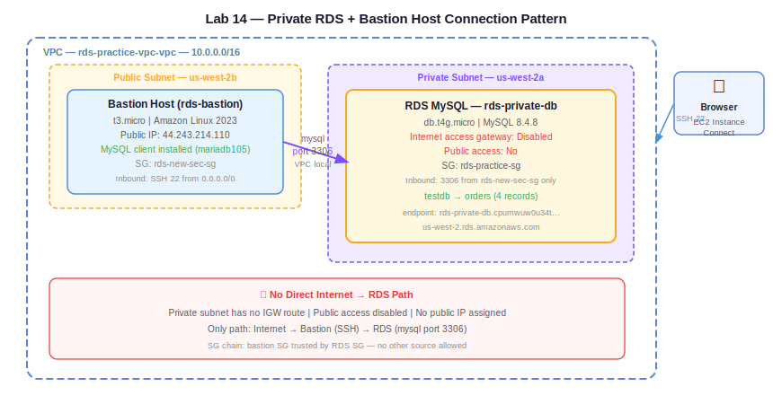

# Practice Log — Lab 14: Private RDS + Bastion Host Connection
**Date:** May 29, 2026
**Resources Created:** RDS MySQL (private subnet), Bastion EC2, Security Groups
**Region:** us-west-2 (Oregon)

---

## What I Built

Deployed RDS MySQL in a private subnet with no public access. Connected to it exclusively through a bastion host using EC2 Instance Connect — the correct production pattern for database access.

---

## Infrastructure Summary

| Resource | Name | Details |
|---|---|---|
| VPC | rds-practice-vpc-vpc | 10.0.0.0/16 |
| Private Subnet Group | rds-private-subnet-group | private subnets, us-west-2a + us-west-2b |
| RDS Instance | rds-private-db | db.t4g.micro, MySQL 8.4.8, us-west-2a, no public access |
| Bastion Host | rds-bastion | t3.micro, Amazon Linux 2023, public subnet us-west-2b |
| Bastion SG | rds-new-sec-sg | Inbound: SSH 22 from 0.0.0.0/0 |
| RDS SG | rds-practice-sg | Inbound: 3306 from rds-new-sec-sg |

---

## 🏗️ Architecture Diagrams

**Claude-generated:**



**Hand-drawn:**


---

## Step by Step

**1. Create private RDS subnet group**

RDS → Subnet groups → Create:
- Name: `rds-private-subnet-group`
- VPC: `rds-practice-vpc-vpc`
- AZs: us-west-2a, us-west-2b
- Subnets: both private subnets

Note: Attempted to modify existing `rds-practice-replica` to use private subnet group — failed. AWS does not allow moving an RDS instance between subnet groups within the same VPC after creation. Had to delete existing instance and create fresh.

**2. Create RDS instance in private subnet**

RDS → Create database → Standard create:
- Engine: MySQL, Free tier
- Identifier: `rds-private-db`
- Username: admin, Password: `Passwd@12`
- Instance: `db.t4g.micro`
- Subnet group: `rds-private-subnet-group` ← private subnets
- Public access: **No**
- SG: `rds-practice-sg`

Confirmed: Internet access gateway shows **Disabled** on the Connectivity tab.

**3. Launch bastion host**

EC2 → Launch instance:
- Name: `rds-bastion`
- AMI: Amazon Linux 2023
- Type: t3.micro
- VPC: `rds-practice-vpc-vpc`
- Subnet: public subnet us-west-2b
- Auto-assign public IP: enabled
- SG: `rds-new-sec-sg` (SSH port 22, 0.0.0.0/0 for EC2 Instance Connect)

**4. Configure security groups**

`rds-new-sec-sg` (bastion):
- Inbound: SSH 22 from 0.0.0.0/0

`rds-practice-sg` (RDS):
- Deleted existing CIDR rule (laptop IP)
- Added: MySQL/Aurora 3306 from `rds-new-sec-sg`

This ensures only the bastion can reach RDS on port 3306.

**5. Connect to bastion via EC2 Instance Connect**

EC2 → `rds-bastion` → Connect → EC2 Instance Connect → Connect

**6. Install MySQL client on bastion**

```bash
sudo dnf install mariadb105 -y
```

**7. Connect to private RDS from bastion**

```bash
mysql -h rds-private-db.cpumwuw0u34t.us-west-2.rds.amazonaws.com -u admin -p
```

Enter password → connected successfully.

**8. Create database, table, and insert records**

```sql
SHOW DATABASES;

CREATE DATABASE testdb;

CREATE TABLE testdb.orders (
    order_id INT AUTO_INCREMENT PRIMARY KEY,
    customer_name VARCHAR(100),
    product_name VARCHAR(100),
    quantity INT,
    price DECIMAL(10,2),
    order_date TIMESTAMP DEFAULT CURRENT_TIMESTAMP,
    status VARCHAR(50)
);

INSERT INTO testdb.orders (customer_name, product_name, quantity, price, status)
VALUES
  ('Abishai', 'MacBook Pro', 1, 2499.00, 'Shipped'),
  ('Rahul', 'iPhone 15', 2, 999.00, 'Processing'),
  ('Priya', 'AirPods Pro', 1, 249.00, 'Delivered'),
  ('Kiran', 'iPad Air', 1, 749.00, 'Pending');

SELECT * FROM testdb.orders;
```

Result: 4 rows returned ✅

---

## Screenshots

| Screenshot | Description |
|---|---|
|  | Bastion EC2 — Running, public IP, public subnet |
|  | Bastion SG — SSH port 22 inbound rule |
|  | RDS — Internet access gateway Disabled (private) |
|  | RDS SG — port 3306 from bastion SG only |
|  | Bastion terminal — successful MySQL connection |
|  | Terminal — CREATE DATABASE + TABLE + INSERT |
|  | Terminal — SELECT showing 4 records |

---

## Troubleshooting

**Issue 1 — Cannot move RDS to different subnet group**
Error: `You cannot move DB instance to subnet group rds-private-subnet-group. The specified DB subnet group and DB instance are in the same VPC.`

Cause: AWS locks subnet group at RDS creation time. Cannot be changed post-creation within same VPC.

Fix: Deleted existing instance, created fresh `rds-private-db` with `rds-private-subnet-group` from the start.

**Issue 2 — mysql command hanging (cursor blinking)**
Cause: `rds-practice-sg` inbound rule was still a CIDR rule (laptop IP). Could not convert existing CIDR rule to SG reference — AWS throws error "You may not specify a referenced group id for an existing IPv4 CIDR rule."

Fix: Deleted the existing CIDR inbound rule, added fresh rule with source set to `rds-new-sec-sg`.

**Issue 3 — ERROR 2002 on first connection attempt**
Cause: SG rule change hadn't propagated yet when first connection attempt was made.

Fix: Waited a few seconds, retried — connected successfully.

---

## Key Observations

**Private RDS = no internet path at all.** Internet access gateway shows Disabled — no route to IGW exists from the private subnet. Even if you enable public access, it won't work without the network path.

**Bastion is the only entry point.** No direct connection from laptop or internet to RDS. All traffic must go through the bastion. This is the production-standard pattern.

**SG chaining is the correct approach:**
```
rds-new-sec-sg (bastion) → allows SSH from internet
rds-practice-sg (RDS)    → allows 3306 from rds-new-sec-sg only
```
RDS never exposed to internet directly. Only the bastion's SG ID is trusted.

**MySQL client vs MySQL server — confirmed again:**
- Bastion has MySQL client (`mariadb105`) — sends queries
- RDS has MySQL server — stores and processes data
- Data lives in RDS storage, not on the bastion EBS

---

## Cleanup

Delete in this order:
1. Terminate EC2 `rds-bastion`
2. Delete RDS `rds-private-db` — Actions → Delete (uncheck snapshots)
3. Delete subnet groups: `rds-private-subnet-group`, `rds-practice-subnet-group`
4. Delete security groups: `rds-new-sec-sg`, `rds-practice-sg`
5. Delete VPC `rds-practice-vpc-vpc`

---

## Cost

- RDS db.t4g.micro: free tier
- EC2 t3.micro bastion: free tier
- No NAT gateway: $0

**Estimated cost: $0 (within free tier)**
