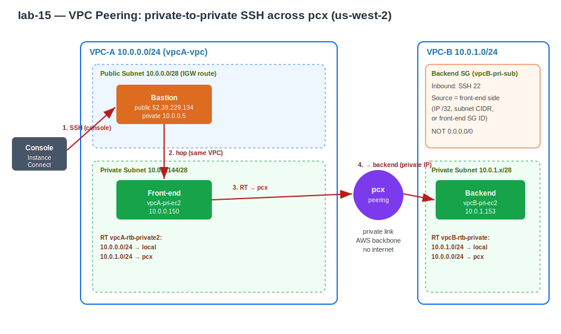

# Practice Log — VPC Peering (private-to-private SSH)
**Date:** May 29, 2026
**Resources Created:** 2 VPCs, 1 peering connection, 3 EC2 instances, IGW, route tables, security groups
**Region:** us-west-2 (Oregon)

---

## What I Built

Two VPCs with non-overlapping CIDRs, connected by a peering connection, proving that a **private** server in VPC-A can SSH to a **private** server in VPC-B over its private IP — no internet, no IGW in the path, no NAT.

| Resource | Detail |
|---|---|
| VPC-A | `10.0.0.0/24` (vpcA-vpc) |
| VPC-A public subnet | `10.0.0.0/28` — bastion lives here |
| VPC-A private subnet | `10.0.0.144/28` (vpcA-subnet-private2) — front-end lives here |
| VPC-B | `10.0.1.0/24` |
| VPC-B private subnet | backend lives here |
| Bastion (vpcA-bastion) | public `52.39.229.134`, private `10.0.0.5` |
| Front-end (vpcA-pri-ec2) | private `10.0.0.150` |
| Backend (vpcB-pri-ec2) | private `10.0.1.153` |
| Peering | `pcx-0bcecb46ec463044a`, same account, same region, status Active |

Connection path:

```
Console (Instance Connect) ─► Bastion (public, VPC-A)
                                 │  same VPC, local route
                                 ▼
                              Front-end (private, VPC-A)
                                 │  RT → pcx → RT
                                 ▼
                              Backend (private, VPC-B)
```

No NAT gateway — this lab only connects servers, it doesn't install packages, so NAT isn't needed.

---

## 🏗️ Architecture Diagram


**Hand-drawn:**


---

## Step by Step

**1. Create the two VPCs**
VPC-A `10.0.0.0/24` with a public and a private subnet; VPC-B `10.0.1.0/24` with a private subnet. CIDRs do not overlap — required, or peering can't route.

**2. Launch 3 instances**
Bastion in VPC-A public subnet (public IP on). Front-end in VPC-A private subnet. Backend in VPC-B private subnet. All Amazon Linux 2023, t2.micro.

**3. Reach the front-end**
Connect to the bastion via EC2 Instance Connect, then hop to the front-end. Same VPC, so the local route handles it — no peering involved yet.

```bash
ssh -i vpc-peer.pem ec2-user@10.0.0.150
```

**4. Create the peering connection**
VPC → Peering connections → Create. Requester VPC-A, accepter VPC-B, same account, same region. Then accept the request (same account = accept it yourself). Status goes Active.

**5. Add routes on both sides**
Peering active is not enough — each VPC's route table needs a route pointing the peer's CIDR at the pcx. Edited the route table associated with each private subnet (traced from each server to its subnet to its route table):

VPC-A private subnet route table — added the peer route:

```
10.0.0.0/24 → local
10.0.1.0/24 → pcx
```

VPC-B private subnet route table — added the mirror route:

```
10.0.1.0/24 → local
10.0.0.0/24 → pcx
```

**6. Secure the backend security group**
Backend SG inbound: SSH (22) only, source scoped to the front-end side — NOT `0.0.0.0/0`.

```
Type: SSH   Port: 22   Source: <!-- FILL IN: front-end IP /32, VPC-A private subnet CIDR 10.0.0.144/28, or front-end SG ID -->
```

**7. Test across the peering**
From the front-end (`10.0.0.150`), SSH to the backend's private IP:

```bash
ssh -i vpc-peer.pem ec2-user@10.0.1.153
```

Prompt changed from `ip-10-0-0-150` to `ip-10-0-1-153` — peering working end to end.

---

## Screenshots


*VPC-A and VPC-B listed with their CIDR ranges.*


*Peering connection pcx-0bcecb46ec463044a — Active.*


*VPC-A subnets and routing overview.*


*VPC-B subnets and routing overview.*


*VPC-A 10.0.0.0/24.*


*VPC-B 10.0.1.0/24.*


*VPC-A private subnet route table — 10.0.1.0/24 → pcx.*


*VPC-B private subnet route table — 10.0.0.0/24 → pcx.*


*Front-end SG inbound — SSH 22 from bastion.*


*Backend SG inbound — SSH 22 scoped to the front-end side.*


*Prompt changes from ip-10-0-0-150 to ip-10-0-1-153 — peering proven.*

---

## Troubleshooting

**SSH timed out on the first attempt, succeeded on a retry seconds later.**
Same command, no changes between tries. This was route/SG-change propagation — a fresh route or security group edit can take a few seconds to take effect. "Connection timed out" means the packet never reached port 22 (route or SG), not a key problem. Retried, it cleared, connection succeeded.

**Ping across the peering failed (100% packet loss) even though SSH worked.**
Not a peering fault. SSH is TCP port 22, which the SG allows; ping is ICMP, a different protocol with no port, and there was no ICMP allow rule — so the SG silently dropped it. SSH succeeding already proved the peering + routing were correct. Confirms two things at once: peering works, and the SG is protocol-scoped rather than wide open. To make ping work, an inbound `All ICMP - IPv4` rule would be needed; left it blocked for the tighter posture.

**Diagnostic lesson — test by layer:**

```
ping        → raw reachability (needs ICMP open, gives false negatives otherwise)
nc -zv host 22  → is the port open? (no key needed — isolates network from auth)
ssh         → full login (timeout = network, refused = no service, denied = key)
```

---

## Cleanup

Delete in dependency order (dependencies first, VPCs last):

1. Terminate all 3 EC2 instances — wait for Terminated state
2. Delete the peering connection
3. Remove the peering routes from both route tables (or delete custom route tables)
4. Delete security groups (after instances are gone)
5. Detach and delete the IGW from VPC-A
6. Delete subnets in both VPCs
7. Delete both VPCs

---

## Cost

~$0. All within free tier — t2.micro instances, no NAT gateway, no data transfer charges of note. Peering itself has no hourly charge; only data transfer is billable, which was negligible. Confirmed zero-spend / $5 budget alerts still active. Tear down same day to stay at zero.
