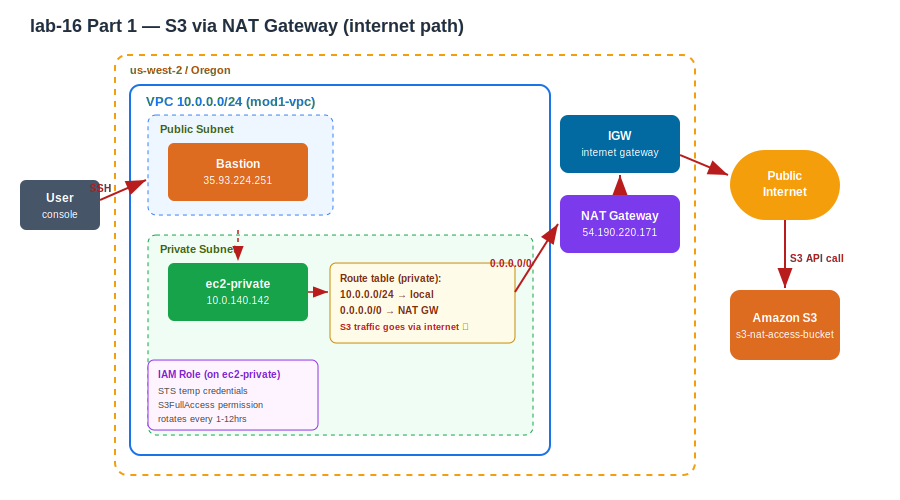
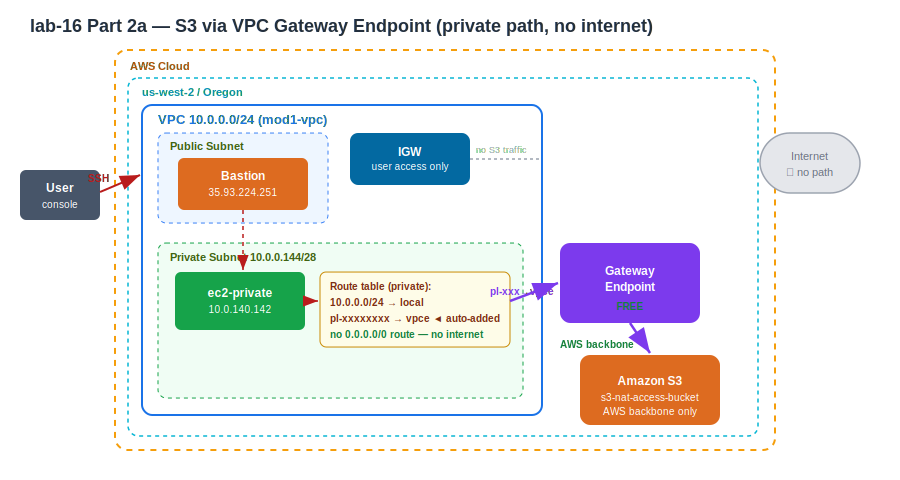

# Practice Log — S3 Access: NAT Gateway vs VPC Endpoint
**Date:** May 30, 2026
**Resources Created:** VPC, public/private subnets, bastion, private EC2, NAT Gateway, IAM role, S3 bucket
**Region:** us-west-2 (Oregon)

---

## Contents
- [Part 1 — S3 via NAT Gateway](#part-1--s3-access-via-nat-gateway)
- [Part 2a — S3 via VPC Gateway Endpoint](#part-2a--s3-access-via-vpc-gateway-endpoint)
- [Part 2b — Secrets Manager via Interface Endpoint](#part-2b--interface-endpoint-secrets-manager)
- [Cleanup](#cleanup)
- [Cost](#cost)

---

## What I Built

Two-part lab proving the difference between reaching S3 via NAT (internet path) vs VPC Gateway Endpoint (private path). Both use the same VPC and private EC2 — only the routing changes.

| Resource | Detail |
|---|---|
| VPC | `10.0.0.0/24` (mod1-vpc) |
| Public subnet | bastion lives here |
| Private subnet | ec2-private lives here (`10.0.140.142`) |
| Bastion | public IP `35.93.224.251` |
| NAT Gateway | `nat-1aa87c29fffdde9a9`, EIP `54.190.220.171` (regional) |
| IAM Role | EC2 service role with S3FullAccess |
| S3 Bucket | `s3-nat-access-bucket` |

---

## Part 1 — S3 Access via NAT Gateway

### What this proves
Private EC2 with no public IP reaches S3 through NAT → IGW → public internet. Traffic leaves the AWS network. Confirmed by matching `curl ifconfig.me` output to the NAT Gateway's Elastic IP.

### 🏗️ Architecture Diagram


**Hand-drawn:**


### How it works

```
ec2-private (10.0.140.142, no public IP)
    │
    ▼
private subnet route table
    0.0.0.0/0 → NAT Gateway
    │
    ▼
NAT Gateway (54.190.220.171)
    │
    ▼
IGW → public internet → https://s3.us-west-2.amazonaws.com
    │
    ▼
S3 bucket (s3-nat-access-bucket) ✓
```

### Step by Step

**1. Connect to private server via bastion**

Connect to bastion via EC2 Instance Connect, then hop to the private server:

```bash
ssh -i vpc-peer.pem ec2-user@10.0.140.142
```

**2. Test S3 access without IAM role**

```bash
aws s3 ls
```

Result: `Unable to locate credentials` — the NAT route existed but the server had no identity. Connection layer works; auth layer missing.

**3. Attach IAM role to the private EC2**

EC2 → select ec2-private → Actions → Security → Modify IAM role → attach role with S3FullAccess → Update.

STS issues temporary credentials in the background automatically. No `aws configure` needed.

**4. Test S3 access with IAM role attached**

```bash
aws s3 ls
```

Result: `2026-05-30 08:51:09 s3-nat-access-bucket` ✓

**5. Prove traffic goes through NAT**

```bash
curl ifconfig.me
```

Result: `54.190.220.171` — matches the NAT Gateway's Elastic IP exactly. The private server has no public IP; NAT is masquerading as `54.190.220.171` for all outbound internet traffic.

**6. Capture the public S3 endpoint in use**

```bash
aws s3 ls --debug 2>&1 | grep -i "endpoint provider result"
```

Result: `Endpoint provider result: https://s3.us-west-2.amazonaws.com` — the public endpoint. After switching to the gateway endpoint in Part 2, this URL will change to an internal one.

Also visible in debug output: `X-Amz-Security-Token` — the STS temporary credential from the IAM role, rotating automatically, never stored on disk.

### Key lesson — connection vs authentication

```
First aws s3 ls:   NAT route existed  +  no IAM role  →  credentials error
Second aws s3 ls:  NAT route existed  +  IAM role      →  works ✓

Connection (how request gets to S3) = route table → NAT → IGW
Auth (who you are)                  = IAM role → STS temporary credentials
Both required. Either alone is not enough.
```

### Why IAM role, not `aws configure`

```
aws configure  → long-lived keys stored on disk
                 if server compromised → keys stolen → permanent access ✗

IAM role       → STS temporary credentials, rotate every 1-12 hours
                 if server compromised → credentials expire automatically ✓
```

### Screenshots


*Connecting via bastion to private server, then running aws s3 ls.*


*curl ifconfig.me returning 54.190.220.171 — matches NAT Gateway EIP.*


*NAT Gateway showing EIP 54.190.220.171 — confirms IP match.*


*mod1-vpc resource map showing subnets and NAT.*


*Private subnet route table — 0.0.0.0/0 → NAT Gateway.*


*IAM role with S3FullAccess attached to ec2-private.*


*aws s3 ls returning s3-nat-access-bucket after IAM role attached.*

---

## Part 2a — S3 Access via VPC Gateway Endpoint

### What this proves
Same private EC2, same IAM role, same S3 bucket — but NAT route deleted. S3 is reachable via the gateway endpoint (private AWS backbone). Internet is completely unreachable. Proven by `aws s3 ls` working while `curl ifconfig.me` hangs.

### 🏗️ Architecture Diagram


**Hand-drawn:**


### How it works

```
ec2-private (10.0.140.142, no public IP)
    │
    ▼
private subnet route table
    pl-xxxxxxxx (S3 prefix list) → vpce-xxxxxxxx (gateway endpoint)
    │
    ▼
VPC Gateway Endpoint
    │  stays on AWS backbone, never touches internet
    ▼
S3 bucket (s3-nat-access-bucket) ✓

curl ifconfig.me → hangs (no internet path at all)
```

### Step by Step

**1. Delete the NAT route from private subnet route table**

VPC → Route Tables → private subnet RT → Routes → Edit routes → delete `0.0.0.0/0 → NAT` → Save.

Note: the route showed **Blackhole** status because the NAT Gateway had already been removed. Either way the internet path was dead.

**2. Confirm S3 is broken without NAT or endpoint**

```bash
aws s3 ls
```

Hangs — no path to S3. Ctrl+C.

**3. Create the Gateway Endpoint**

VPC → Endpoints → Create endpoint:
- Name: `mod1-s3-gateway-endpoint`
- Type: AWS services
- Service: `com.amazonaws.us-west-2.s3` (type: **Gateway**)
- VPC: `mod1-vpc`
- Route table: private subnet RT (`rtb-047c5dd51e8b28c19`)
- Create

AWS automatically adds `pl-xxxxxxxx → vpce-xxxxxxxx` to the selected route table. No manual route entry needed.

**4. Verify route appeared automatically**

VPC → Route Tables → private subnet RT → Routes tab:

```
pl-xxxxxxxx (com.amazonaws.us-west-2.s3)  →  vpce-xxxxxxxx   Active
```

**5. Test S3 — works via endpoint**

```bash
aws s3 ls
```

Result: `2026-05-30 08:51:09 s3-nat-access-bucket` ✓

**6. Test internet — proves no internet path**

```bash
curl ifconfig.me
```

Result: hangs, Ctrl+C — no response. No internet access at all. NAT route is gone, and the gateway endpoint only handles S3 traffic, not general internet.

### Key lesson — the contrast with Model-1

```
Model-1 (NAT):
  aws s3 ls      → works ✓   (via NAT → internet → S3)
  curl ifconfig  → 54.190.220.171 ✓  (internet works)

Model-2a (Gateway Endpoint):
  aws s3 ls      → works ✓   (via endpoint → AWS backbone)
  curl ifconfig  → hangs ✗   (no internet at all)

Same result for S3. Completely different path. Endpoint is free, private, faster.
```

### Gateway endpoint key facts

```
Cost:     FREE
Services: S3 and DynamoDB only
How:      route table entry (pl-xxxxx → vpce-xxxxx), added automatically
ENI:      none created — it's just a route, not a network interface
Scope:    only subnets whose route tables include the endpoint route can use it
```

### Screenshots


*Creating the S3 Gateway Endpoint — AWS services type, Gateway selected.*


*Gateway endpoint details showing mod1-s3-gateway-endpoint, Available status.*


*Private subnet route table — pl-xxxxx → vpce-xxxxx route added automatically.*


*curl ifconfig.me hanging (no internet) while aws s3 ls works — endpoint proven.*


*EC2 Instance Connect Endpoint — connecting to private server directly without bastion.*

---

## Part 2b — Interface Endpoint (Secrets Manager)

*To be completed after Secrets Manager interface endpoint practical.*

---

## Cleanup

*(To be completed after Part 2b — delete in dependency order)*

## Cost

NAT Gateway: ~$0.045/hour + $0.045/GB data processed. Gateway endpoint: free. EC2 instances: free tier (t2.micro). S3 bucket: free tier. Interface endpoint (Part 2b): ~$0.01/hour per AZ.
