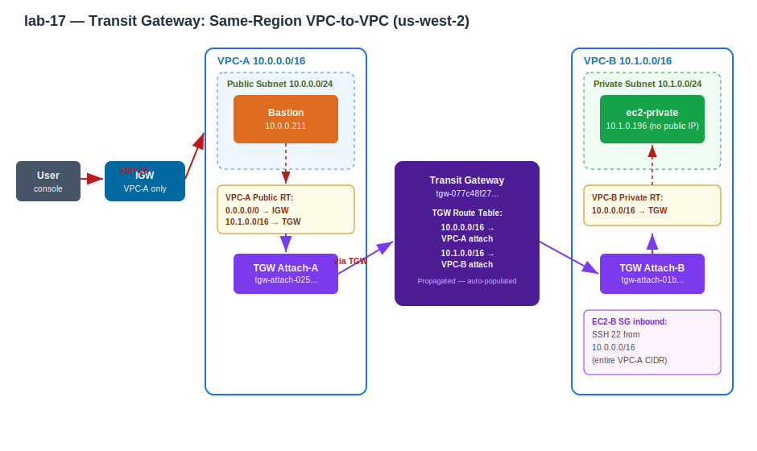

# Practice Log — Transit Gateway: Same-Region VPC-to-VPC
**Date:** May 31, 2026
**Resources Created:** 2 VPCs, 1 Transit Gateway, 2 TGW attachments, 2 EC2 instances, IGW, route tables, security groups
**Region:** us-west-2 (Oregon)

---

## Contents
- [What I Built](#what-i-built)
- [Architecture](#architecture)
- [Step by Step](#step-by-step)
- [Mistakes & Fixes](#mistakes--fixes)
- [Proof of Connectivity](#proof-of-connectivity)
- [Key Lessons](#key-lessons)
- [Screenshots](#screenshots)
- [Cleanup](#cleanup)
- [Cost](#cost)

---

## What I Built

Two private VPCs connected via a Transit Gateway in the same region. A bastion in VPC-A's public subnet SSHs to a private EC2 in VPC-B with no public IP — traffic crosses the TGW. No VPC peering, no internet path between VPCs.

| Resource | Detail |
|---|---|
| VPC-A | `10.0.0.0/16` (VPC-A-vpc) |
| VPC-A public subnet | `10.0.0.0/24` — bastion lives here |
| VPC-B | `10.1.0.0/16` (VPC-B-vpc) |
| VPC-B private subnet | `10.1.0.0/24` — ec2-private lives here |
| Bastion | public `52.11.142.123`, private `10.0.0.211` |
| EC2-B | private `10.1.0.196`, no public IP |
| Transit Gateway | `tgw-077c48f273dc7a281` (TGW-A-B), us-west-2 |
| TGW Attachment A | `tgw-attach-02538c307c514a3a4` → VPC-A |
| TGW Attachment B | `tgw-attach-01b69001990dc966d` → VPC-B |
| TGW Route Table | `tgw-rtb-0f56b74e19c7feaa5` — both CIDRs propagated |

---

## Architecture

```
User (SSH 22)
    │
    ▼
Public Internet
    │
    ▼
IGW (VPC-A)
    │
    ▼
┌─────────────────────────────┐
│  VPC-A  10.0.0.0/16         │
│  ┌──────────────────────┐   │
│  │ Public Subnet        │   │
│  │ 10.0.0.0/24          │   │
│  │  ┌──────────────┐    │   │
│  │  │   Bastion    │    │   │
│  │  │ 10.0.0.211   │    │   │
│  │  └──────┬───────┘    │   │
│  └─────────┼────────────┘   │
│            │ RT: 10.1.0.0/16 → TGW
│  TGW-A Attachment            │
└────────────┼────────────────┘
             │
             ▼
    ┌─────────────────┐
    │ Transit Gateway  │
    │ tgw-077c48f27... │
    │                  │
    │ TGW Route Table: │
    │ 10.0.0.0/16 →    │
    │   VPC-A attach   │
    │ 10.1.0.0/16 →    │
    │   VPC-B attach   │
    └────────┬─────────┘
             │
┌────────────┼────────────────┐
│  VPC-B  10.1.0.0/16         │
│  TGW-B Attachment            │
│            │ RT: 10.0.0.0/16 → TGW
│  ┌─────────┼────────────┐   │
│  │ Private Subnet       │   │
│  │ 10.1.0.0/24          │   │
│  │  ┌──────┴───────┐    │   │
│  │  │  ec2-private │    │   │
│  │  │ 10.1.0.196   │    │   │
│  │  │ no public IP │    │   │
│  │  └──────────────┘    │   │
│  └──────────────────────┘   │
└─────────────────────────────┘
```

---

## 🏗️ Architecture Diagram


**Hand-drawn:**


---

## Step by Step

**1. Create VPC-A and VPC-B with non-overlapping CIDRs**

```
VPC-A: 10.0.0.0/16   public subnet:  10.0.0.0/24
VPC-B: 10.1.0.0/16   private subnet: 10.1.0.0/24
```

Second octet differs — ranges don't overlap. Required for TGW routing exactly as with VPC peering.

**2. VPC-A: IGW + public route table**

Create IGW → attach to VPC-A → add `0.0.0.0/0 → IGW` to VPC-A public subnet route table. Bastion needs this to be reachable from the internet.

**3. Launch instances**

Bastion in VPC-A public subnet with auto-assign public IP on. EC2-B in VPC-B private subnet with no public IP. Both use `vpc-peer.pem` key pair.

**4. EC2-B security group — SSH from VPC-A CIDR**

```
Type: SSH   Port: 22   Source: 10.0.0.0/16
```

Source is the entire VPC-A CIDR — covers the bastion regardless of its private IP. This was the fix that resolved the initial failed attempt.

**5. Create Transit Gateway**

VPC → Transit Gateways → Create:
- Name: `TGW-A-B`
- ASN: 64512 (default)
- CIDR blocks: **leave empty** — not needed for basic VPC-to-VPC routing
- Default association route table: enabled
- Default propagation route table: enabled
- Wait for Available status (2-3 minutes)

**6. Create TGW attachments**

One attachment per VPC — tells TGW which VPCs to connect:

```
Attachment A: TGW-A-B → VPC-A → public subnet
Attachment B: TGW-A-B → VPC-B → private subnet
```

Both must show **Available** before adding routes.

**7. Update VPC route tables**

VPC-A public subnet RT — add TGW route:
```
10.1.0.0/16 → tgw-077c48f273dc7a281
```

VPC-B private subnet RT — add TGW route:
```
10.0.0.0/16 → tgw-077c48f273dc7a281
```

Both sides required — one-sided routing means traffic goes out but replies have no path home.

**8. TGW route table — auto-populated via propagation**

Because default propagation was enabled, TGW RT auto-populated both routes:
```
10.0.0.0/16 → tgw-attach-02538c307c514a3a4 (VPC-A)   Propagated  Active
10.1.0.0/16 → tgw-attach-01b69001990dc966d (VPC-B)   Propagated  Active
```

No manual static routes needed when propagation is enabled.

**9. Test**

From bastion SSH to EC2-B private IP:
```bash
ssh -i vpc-peer.pem ec2-user@10.1.0.196
```

Prompt changed to `ip-10-1-0-196` — TGW routing confirmed.

---

## Mistakes & Fixes

**Attempt 1 — connection failed, started over**

First build had a misconfigured EC2-B security group. The SSH source was too narrow and didn't cover the bastion's IP. Rather than debug further, rebuilt cleanly from scratch with the SG rule set correctly from the start (step 4 above — SSH from `10.0.0.0/16` entire VPC-A CIDR).

Lesson: **set the security group source to the entire peer VPC CIDR** (`10.0.0.0/16`), not a specific IP. Bastions can have different private IPs across builds.

**TGW CIDR block confusion**

The TGW creation form shows an optional CIDR block field. This is NOT where you put the VPC CIDRs. Leave it empty — VPC CIDRs go into route tables, not the TGW itself. The TGW CIDR is only needed for advanced use cases like VPN appliance mode.

```
TGW CIDR field:  leave empty for basic VPC-to-VPC ✓
VPC CIDRs:       go into VPC route tables and TGW route table ✓
```

---

## Proof of Connectivity

```bash
# On ec2-private (10.1.0.196) after SSH via TGW:

hostname -I
10.1.0.196           ← confirmed on VPC-B private server

curl ifconfig.me --max-time 5
curl: (28) Connection timed out   ← no internet, private server confirmed

traceroute 10.0.0.211
1  * * *             ← TGW drops ICMP probes — expected, not a failure
...                  ← traceroute * * * does NOT mean TGW is broken

ping -c 3 10.0.0.211
100% packet loss     ← bastion SG blocks ICMP inbound — expected
```

**Why traceroute and ping show nothing:**

```
SSH  = TCP port 22  → allowed by SG → works ✓
ping = ICMP         → blocked by SG → 100% loss (not a TGW problem)
traceroute = ICMP   → TGW absorbs probes → all * * * (not a TGW problem)

SSH working = TGW routing proven. Traceroute/ping are irrelevant here.
```

---

## Key Lessons

**TGW vs VPC Peering:**

```
VPC Peering:                    Transit Gateway:
─────────────────────           ─────────────────────
one-to-one only                 one-to-many (hub-spoke)
non-transitive                  transitive ✓
n(n-1)/2 connections            1 connection per VPC
route table per pcx pair        one TGW RT for all VPCs
no hourly cost                  ~$0.05/hour + data transfer
```

**TGW has its own route table — this is the key difference from peering:**

```
VPC Peering:   VPC-A RT → pcx → VPC-B RT
                         ↑ direct link, no middle routing

Transit Gateway: VPC-A RT → TGW → TGW RT → TGW → VPC-B RT
                                    ↑ TGW decides where to send traffic
                                      based on its own route table
```

**Propagation vs static routes on TGW RT:**

```
Propagation enabled (default):
  TGW RT auto-learns VPC CIDRs when attachments are created
  no manual route entry needed

Static routes:
  used for more complex scenarios (VPN, overlapping CIDRs, blackhole routes)
  not needed for basic VPC-to-VPC
```

**Build order matters:**

```
1. VPCs + subnets
2. Instances + SGs ← set SG source correctly here, before TGW
3. TGW
4. Attachments
5. Route tables (VPC side + TGW side)
6. Test
```

Setting the SG at step 2 (before TGW) prevents the "forgot the SG" failure mode.

---

## Screenshots


*Transit Gateway tgw-077c48f273dc7a281 — Available, default route table association and propagation enabled.*


*TGW attachment for VPC-A — Available.*


*TGW attachment for VPC-B — Available.*


*TGW route table — 10.0.0.0/16 and 10.1.0.0/16 both propagated and Active.*


*VPC-A public subnet route table — 10.1.0.0/16 → TGW.*


*VPC-B private subnet route table — 10.0.0.0/16 → TGW.*


*EC2-B security group — SSH 22 inbound from 10.0.0.0/16 (entire VPC-A CIDR).*


*Prompt showing ip-10-1-0-196 — SSH from bastion (VPC-A) to ec2-private (VPC-B) via TGW.*


*Traceroute all * * * — expected, TGW drops ICMP probes. SSH working is the real proof.*

---

## Cleanup

Delete in dependency order:

1. Terminate EC2 instances (bastion + ec2-private) — wait for Terminated
2. Delete TGW attachments — wait for Deleted (takes 2-3 minutes each)
3. Delete Transit Gateway — wait for Deleted
4. Delete custom route tables
5. Delete security groups
6. Delete subnets
7. Detach and delete IGW from VPC-A
8. Delete VPC-A and VPC-B

TGW and attachments must fully delete before VPCs can be deleted — don't rush this step.

---

## Cost

Transit Gateway: ~$0.05/hour + $0.02/GB data processed. Delete promptly after lab. EC2 instances: free tier (t2.micro). No NAT gateway used — ~$0 beyond TGW hourly charge.
