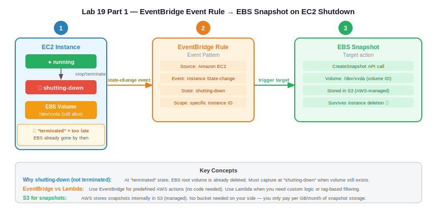
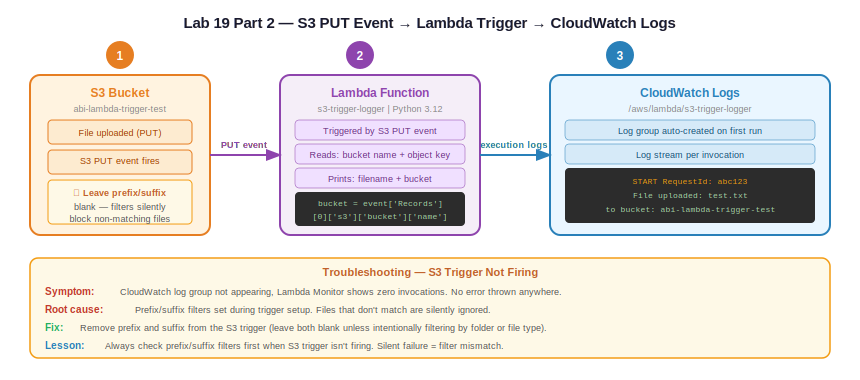

# Practice Log — EventBridge Event Rule + Lambda S3 Trigger

**Date:** June 6–7, 2026
**Resources Created:** EventBridge rule, EC2 instance, EBS snapshot, Lambda function, S3 bucket
**Region:** us-west-2

---

## Contents

- [Part 1 — EventBridge Event Rule → EBS Snapshot](#part-1--eventbridge-event-rule--ebs-snapshot)
- [Part 2 — S3 → Lambda Trigger](#part-2--s3--lambda-trigger)
- [Cleanup](#cleanup)
- [Troubleshooting](#troubleshooting)
- [Cost](#cost)

---

## Part 1 — EventBridge Event Rule → EBS Snapshot

### What I Built

An EventBridge event rule that automatically creates an EBS snapshot whenever an EC2 instance enters the `shutting-down` state. No manual snapshot needed — the moment EC2 starts terminating, the backup fires automatically.

### Architecture

```
EC2 Instance
    |
    | stop / terminate
    ▼
state: shutting-down  ──── state-change event ────►  EventBridge Rule
                                                       Source: Amazon EC2
                                                       Event: State-change
                                                       State: shutting-down
                                                       Scope: Instance ID
                                                           |
                                                           | trigger target
                                                           ▼
EBS Volume /dev/xvda  ◄──────────────────────────  EBS Snapshot
(still alive at                                     CreateSnapshot call
 shutting-down)                                     Stored in S3 (AWS-managed)
                                                    Survives instance deletion ✓

⚠ "terminated" = too late — EBS already deleted by then
   Always capture at shutting-down
```



**Hand-drawn diagram:**


### Step by Step

**Step 1 — Launch EC2**

Launch a t2.micro in us-west-2, Amazon Linux 2023, default VPC. Note the Instance ID and Volume ID from the Storage tab.

**Step 2 — Create EventBridge Rule**

EventBridge → Rules → Create rule:
- Rule type: Event pattern (not schedule)
- Event source: AWS services
- AWS service: EC2
- Event type: EC2 Instance State-change Notification
- Specific state: `shutting-down`
- Specific instance ID: paste your instance ID

Target:
- Target type: AWS service
- Target: EC2 CreateSnapshot
- Volume ID: paste your EBS volume ID

→ Create rule

**Step 3 — Test**

Terminate the EC2 instance. Wait 1–2 minutes.

EC2 console → Elastic Block Store → Snapshots → snapshot appears with status `pending` → `completed`.

### Screenshots

| File | Description |
|---|---|
| `eb-rule-detail.png` | EventBridge rule showing event pattern and target |
| `ec2-terminated.png` | EC2 instance in terminated state |
| `snapshot-list.png` | Snapshots list showing completed snapshot |
| `snapshot-detail.png` | Snapshot detail — source volume, 100% progress, completed timestamp |


---

## Part 2 — S3 → Lambda Trigger

### What I Built

An S3 PUT event trigger on a Lambda function. Any file uploaded to the S3 bucket automatically invokes Lambda, which logs the filename and bucket name to CloudWatch.

### Architecture

```
File uploaded to S3 bucket
         |
         | S3 PUT event fires
         ▼
Lambda Function (s3-trigger-logger)
Python 3.12 — boto3
Reads: bucket name + object key
Prints: "File uploaded: {key} to bucket: {bucket}"
         |
         ▼
CloudWatch Logs
/aws/lambda/s3-trigger-logger
Verify execution output
```



**Hand-drawn diagram:**


### Step by Step

**Step 1 — Create S3 bucket**

S3 → Create bucket → `abi-lambda-trigger-test` → us-west-2 → all defaults → Create.

**Step 2 — Create Lambda function**

Lambda → Create function → Author from scratch:
- Function name: `s3-trigger-logger`
- Runtime: Python 3.12
- Permissions: Create a new role with basic Lambda permissions

→ Create function

**Step 3 — Add S3 trigger**

Lambda function page → Add trigger → S3:
- Bucket: `abi-lambda-trigger-test`
- Event types: PUT
- Leave prefix and suffix blank (do not fill these unless filtering by folder/extension)

→ Add

**Step 4 — Add code**

Code tab → replace default code → Deploy:

```python
import json

def lambda_handler(event, context):
    bucket = event['Records'][0]['s3']['bucket']['name']
    key = event['Records'][0]['s3']['object']['key']
    print(f"File uploaded: {key} to bucket: {bucket}")
    return {
        'statusCode': 200,
        'body': json.dumps('Trigger successful')
    }
```

**Step 5 — Test**

S3 → bucket → Upload → any file → Upload.

**Step 6 — Verify in CloudWatch**

CloudWatch → Log groups → `/aws/lambda/s3-trigger-logger` → latest log stream → confirm print output showing filename and bucket name.

Alternatively: Lambda → Monitor tab → View CloudWatch logs.

### Screenshots

| File | Description |
|---|---|
| `lambda-function-list.png` | Lambda functions list showing s3-trigger-logger |
| `lambda-s3-trigger-configured.png` | Lambda function overview showing S3 trigger attached |
| `lambda-code-s3-handler.png` | Lambda code editor showing Python handler |
| `s3-upload-test-success.png` | S3 bucket showing uploaded test file |
| `cloudwatch-log-groups.png` | CloudWatch log groups showing Lambda log group |
| `cloudwatch-log-stream.png` | CloudWatch log stream showing trigger execution output |


---

## Troubleshooting

**Issue:** Lambda trigger not firing after S3 upload
**Symptom:** CloudWatch log group `/aws/lambda/s3-trigger-logger` not appearing. Lambda Monitor tab showing no invocations.
**Root cause:** Prefix and suffix filters were set during trigger configuration. Files that don't match the filter are silently ignored — no error thrown.
**Fix:** Remove prefix and suffix from the S3 trigger configuration (leave both blank unless intentionally filtering).
**Lesson:** If an S3 trigger isn't firing, check prefix/suffix filters first — they silently block non-matching uploads with no error or warning.

---

## Cleanup

**Part 1:**
1. Delete snapshot — EC2 → Snapshots → select → Actions → Delete
2. Delete EventBridge rule — EventBridge → Rules → select → Delete
3. EC2 already terminated, EBS auto-deleted with instance

**Part 2:**
1. Delete Lambda function — Lambda → Functions → select → Actions → Delete
2. Empty S3 bucket — S3 → bucket → Empty
3. Delete S3 bucket — S3 → bucket → Delete
4. Delete CloudWatch log group — CloudWatch → Log groups → `/aws/lambda/s3-trigger-logger` → Delete

---

## Cost

| Resource | Cost |
|---|---|
| EC2 t2.micro | Free tier |
| EBS snapshot (1.61 GiB, deleted same day) | ~$0.00 |
| Lambda invocations (< 10) | Free tier |
| S3 storage (< 1MB, deleted same day) | ~$0.00 |
| EventBridge rules | Free for AWS service events |
| **Total** | **~$0.00** |
