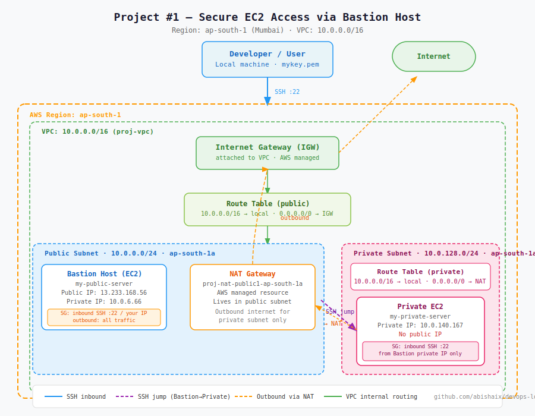

# Project #1 — Secure EC2 Access via Bastion Host

**Status:** ✅ Complete  
**Built:** April 2026  
**Region:** ap-south-1 (Mumbai)  
**Cost:** ~$0.05 (NAT Gateway hourly) — terminated after build

---

## What This Project Is

In production, private servers are never directly exposed to the internet. But engineers still need SSH access to manage them. The standard solution is a **Bastion Host** — a single hardened jump server in your public subnet that acts as the only SSH entry point into your private infrastructure.

This project builds that architecture from scratch on AWS: custom VPC, public and private subnets, Internet Gateway, NAT Gateway, two EC2 instances, and locked-down Security Groups.

---

## Architecture



### Traffic Flows

**Inbound SSH (engineer access):**
```
Developer laptop → Internet → IGW → Bastion (public subnet) → Private EC2
```

**Outbound internet from private EC2 (package installs, updates):**
```
Private EC2 → Private Route Table → NAT Gateway → IGW → Internet
```

---

## What Was Built

| Resource | Name | Details |
|----------|------|---------|
| VPC | proj-vpc | 10.0.0.0/16 |
| Public Subnet | proj-subnet-public1-ap-south-1a | 10.0.0.0/24 · ap-south-1a |
| Private Subnet | proj-subnet-private1-ap-south-1a | 10.0.128.0/24 · ap-south-1a |
| Internet Gateway | proj-igw | Attached to proj-vpc |
| NAT Gateway | proj-nat-public1-ap-south-1a | In public subnet · Elastic IP assigned |
| Route Table (public) | proj-rtb-public | 0.0.0.0/0 → IGW |
| Route Table (private) | proj-rtb-private1-ap-south-1a | 0.0.0.0/0 → NAT |
| Bastion EC2 | my-public-server | t3.micro · Amazon Linux 2023 · public IP |
| Private EC2 | my-private-server | t3.micro · Amazon Linux 2023 · no public IP |

---

## Security Group Rules

### Bastion Host SG
| Direction | Protocol | Port | Source | Why |
|-----------|----------|------|--------|-----|
| Inbound | SSH | 22 | Your IP only | Restrict SSH to known IP |
| Outbound | All | All | 0.0.0.0/0 | Allow outbound connections |

### Private EC2 SG
| Direction | Protocol | Port | Source | Why |
|-----------|----------|------|--------|-----|
| Inbound | SSH | 22 | Bastion private IP (10.0.6.66/32) | Only Bastion can SSH in |
| Outbound | All | All | 0.0.0.0/0 | Allow outbound via NAT |

---

## How to Reproduce This

### Prerequisites
- AWS account with free tier
- Key pair (`.pem` file) created in your target region
- AWS CLI or Console access

### Step 1 — Create the VPC
Use the AWS Console VPC wizard:
- CIDR: `10.0.0.0/16`
- 1 public subnet, 1 private subnet
- Enable NAT Gateway (1 AZ)
- Enable DNS hostnames

### Step 2 — Enable Auto-assign Public IP on Public Subnet
Go to Subnets → select public subnet → Actions → Edit subnet settings → enable **Auto-assign public IPv4 address**.

> Without this, EC2 instances in the public subnet won't get a public IP even if IGW is attached.

### Step 3 — Launch Bastion EC2
- Subnet: public subnet
- AMI: Amazon Linux 2023
- Instance type: t3.micro
- Key pair: your `.pem` key
- Security Group: SSH port 22, source = your IP

### Step 4 — Launch Private EC2
- Subnet: private subnet
- AMI: Amazon Linux 2023
- Instance type: t3.micro
- Key pair: same `.pem` key
- **Disable auto-assign public IP**
- Security Group: SSH port 22, source = Bastion's private IP

### Step 5 — SSH into Bastion
```bash
chmod 400 mykey.pem
ssh -i "mykey.pem" ec2-user@<bastion-public-ip>
```

### Step 6 — SSH from Bastion into Private EC2
```bash
# On the Bastion host:
ssh -i "mykey.pem" ec2-user@<private-ec2-private-ip>
```

### Step 7 — Verify NAT Gateway (from private EC2)
```bash
ping google.com
```
Successful ping confirms private EC2 reaches internet through NAT Gateway.

---

## Verified Output

**Bastion SSH session:**
```
[ec2-user@ip-10-0-6-66 ~]$ whoami
ec2-user
[ec2-user@ip-10-0-6-66 ~]$ hostname
ip-10-0-6-66.ap-south-1.compute.internal
```

**Private EC2 SSH session (via Bastion):**
```
[ec2-user@ip-10-0-140-167 ~]$ whoami
ec2-user
[ec2-user@ip-10-0-140-167 ~]$ hostname
ip-10-0-140-167.ap-south-1.compute.internal
```

**NAT Gateway verified:**
```
[ec2-user@ip-10-0-140-167 ~]$ ping google.com
64 bytes from lcbomp-in-f113.1e100.net (192.178.211.113): icmp_seq=1 ttl=109 time=2.72 ms
64 bytes from lcbomp-in-f113.1e100.net (192.178.211.113): icmp_seq=2 ttl=109 time=2.47 ms
```

---

## Mistakes Made & What They Taught Me

**1. Security Group opened to all traffic initially**  
Instinct when stuck is to open everything. I set inbound to "All traffic / 0.0.0.0/0" to test connectivity. It worked but it's a security hole — in production this would expose the server to the entire internet. Fix: lock SG to SSH port 22, source = your specific IP.

**2. Auto-assign public IP not enabled on public subnet**  
Created the public subnet and launched an EC2, but the instance had no public IP. EC2 couldn't be reached. Cause: AWS doesn't auto-assign public IPs by default — you have to explicitly enable it on the subnet settings. Fix: Subnets → Edit subnet settings → Enable auto-assign public IPv4.

**3. Typo in SSH username (`ece-user` instead of `ec2-user`)**  
After fixing the key permissions with `chmod 400`, SSH was still failing. The error looked like a key problem but it was actually a username typo. `ece-user` doesn't exist on Amazon Linux — the correct user is `ec2-user`. The AWS Console's copy-paste command had the right username which is why using it directly worked.

**Lesson:** When SSH denies with `Permission denied (publickey)`, check the username first before assuming the key is wrong.

---

## Security Note — Key Forwarding vs Copying the Key

In this project, the `.pem` key was copied to the Bastion host to SSH into the private EC2. **This is not best practice.**

The correct approach is **SSH Agent Forwarding**:
```bash
ssh -A -i "mykey.pem" ec2-user@<bastion-public-ip>
```
The `-A` flag forwards your local SSH agent to the Bastion, allowing it to authenticate to the private EC2 without the key ever touching the Bastion disk. If the Bastion is compromised, your key stays safe.

This is on the learning list for the next iteration.

---

## Cleanup Checklist

Delete in this order to avoid dependency errors:

- [ ] Terminate both EC2 instances
- [ ] Delete NAT Gateway (wait for it to fully delete — takes ~2 min)
- [ ] Release Elastic IP (allocated for NAT Gateway)
- [ ] Delete subnets
- [ ] Detach and delete Internet Gateway
- [ ] Delete route tables (custom ones only)
- [ ] Delete Security Groups (custom ones only)
- [ ] Delete VPC

> NAT Gateway accrues hourly charges. Always delete it first after a practice session.

---

## Key Concepts Demonstrated

- Custom VPC design with public/private subnet separation
- Internet Gateway for public inbound/outbound access
- NAT Gateway for private subnet outbound-only internet access
- Route table configuration — one per subnet, different default routes
- Security Group principle of least privilege
- Bastion Host pattern for secure private server access
- SSH key-based authentication and file permissions (`chmod 400`)

---

## Related Notes

- [Day 07 — Custom VPC Networking](../../notes/day-07-custom-vpc-networking.md)
- [Day 08 — Bastion Host & NAT Gateway](../../notes/day-08-bastion-host-nat-gateway.md)
- [Day 09 — NAT Gateway Deep Dive](../../notes/day-09-nat-gateway-deep-dive.md)
- [Day 10 — App Deployment with Nginx](../../notes/day-10-app-deployment-nginx.md)
