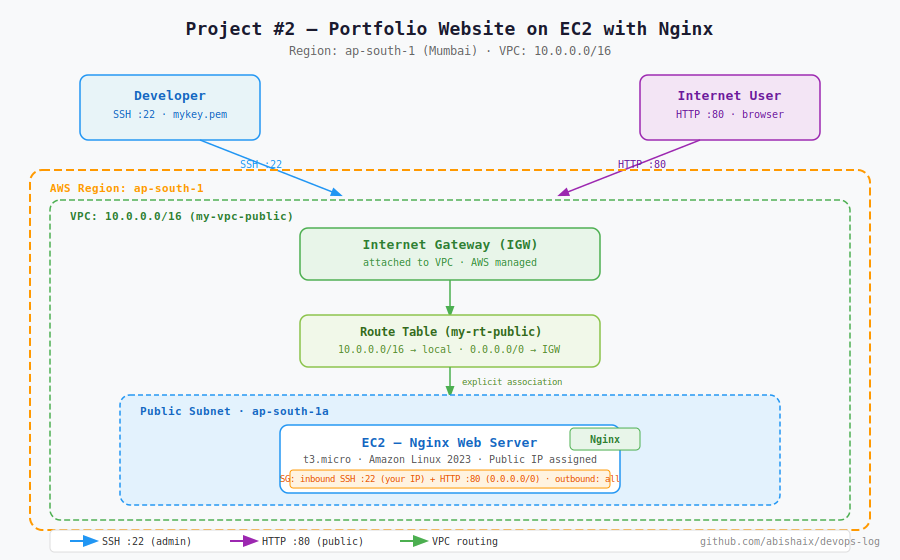

# Project #2 — Portfolio Website Hosted on EC2 with Nginx

**Status:** ✅ Complete  
**Built:** April 2026  
**Region:** ap-south-1 (Mumbai)  
**Cost:** ~$0.00 (t3.micro free tier, no NAT Gateway)

---

## What This Project Is

A static portfolio website served via Nginx on an AWS EC2 instance. Built with a fully custom VPC — no wizards, every resource created and wired manually. Demonstrates the complete path from raw AWS networking to a publicly accessible web server.

---

## Architecture



**Design process:** [View original hand-drawn draft](diagrams/architecture-draft.png)

### Traffic Flow

**Web visitor:**
```
Browser → Internet → IGW → Route Table → Public Subnet → EC2 (Nginx) → HTML page
```

**Engineer (SSH):**
```
Terminal → Internet → IGW → Route Table → Public Subnet → EC2 port 22
```

---

## What Was Built

| Resource | Name | Details |
|----------|------|---------|
| VPC | my-vpc-public | 10.0.0.0/16 |
| Public Subnet | my-subnet-public | ap-south-1a |
| Internet Gateway | my-igw | Attached to VPC |
| Route Table | my-rt-public | 0.0.0.0/0 → IGW · explicitly associated to subnet |
| Security Group | my-sg-public | SSH :22 + HTTP :80 inbound |
| EC2 | my-webserver | t3.micro · Amazon Linux 2023 · Nginx |

---

## Security Group Rules

| Direction | Protocol | Port | Source | Why |
|-----------|----------|------|--------|-----|
| Inbound | SSH | 22 | Your IP | Admin access |
| Inbound | HTTP | 80 | 0.0.0.0/0 | Public web traffic |
| Outbound | All | All | 0.0.0.0/0 | Allow outbound |

---

## How to Reproduce This

### Step 1 — Create VPC manually
- CIDR: `10.0.0.0/16`
- No wizard — create VPC only

### Step 2 — Create Public Subnet
- Attach to your VPC
- Enable auto-assign public IPv4 address

### Step 3 — Create and Attach Internet Gateway
- Create IGW
- Actions → Attach to VPC

### Step 4 — Create Route Table and Associate Subnet
- Create route table, attach to VPC
- Add route: `0.0.0.0/0 → IGW`
- **Subnet associations → explicitly associate your public subnet**

> Without explicit subnet association, the subnet uses the default route table with no IGW route and stays private. This is the most commonly missed step when building VPCs manually.

### Step 5 — Create Security Group
- Inbound: SSH port 22 (your IP), HTTP port 80 (0.0.0.0/0)
- Attach to your VPC

### Step 6 — Launch EC2
- Subnet: your public subnet
- SG: your custom SG
- Key pair: your `.pem` file

### Step 7 — Install and Start Nginx
```bash
sudo yum update -y
sudo yum install nginx -y
sudo systemctl start nginx
sudo systemctl enable nginx
sudo systemctl status nginx
```

### Step 8 — Deploy Portfolio Page
```bash
sudo nano /usr/share/nginx/html/index.html
# paste your HTML, save with Ctrl+X → Y → Enter
```

### Step 9 — Verify
Open `http://<ec2-public-ip>` in browser. Portfolio loads.

---

## Portfolio Site

The deployed site is a single-file HTML portfolio. Source: [`site/index.html`](site/index.html)

---

## Mistakes Made & What They Teach

**1. Subnet not appearing in EC2 launch wizard**  
Created a custom subnet but it didn't show up when launching the EC2. Cause: the subnet was accidentally created inside the default VPC, not the custom one. Fix: always verify the VPC column in the Subnets list before proceeding.

**2. "Instance is not in public subnet" error**  
EC2 launched but EC2 Instance Connect refused with this error. Cause: the custom route table with the IGW route was created but never explicitly associated with the subnet. The subnet was still using the main/default route table which had no IGW entry. Fix: Route Tables → Subnet associations → Edit → associate the subnet.

**3. Security Group not attached to correct VPC**  
Created SG but it wasn't appearing as an option during EC2 launch. Cause: SG was created in a different VPC. Fix: always check the VPC ID when creating SGs, subnets, and route tables — everything must belong to the same VPC.

**Lesson:** In AWS, nothing is implicit. Creating resources in the right order is not enough — every association must be made explicitly: subnet ↔ route table, IGW ↔ VPC, SG ↔ VPC.

---

## Key Concepts Demonstrated

- Manual VPC build — every resource created and associated explicitly
- Route table subnet association — the step the wizard hides
- Nginx installation and service management on Amazon Linux 2023
- Security Group design for a public web server (SSH + HTTP)
- Static site deployment via EC2 + Nginx

---

## Cleanup Checklist

- [ ] Terminate EC2 instance
- [ ] Delete Security Group
- [ ] Delete Route Table (custom)
- [ ] Detach and delete Internet Gateway
- [ ] Delete Subnet
- [ ] Delete VPC

---

## Related Notes

- [Day 06 — EC2, IGW, Route Tables](../../notes/day-06-ec2-igw-route-table.md)
- [Day 07 — Custom VPC Networking](../../notes/day-07-custom-vpc-networking.md)
- [Day 10 — App Deployment with Nginx](../../notes/day-10-app-deployment-nginx.md)
